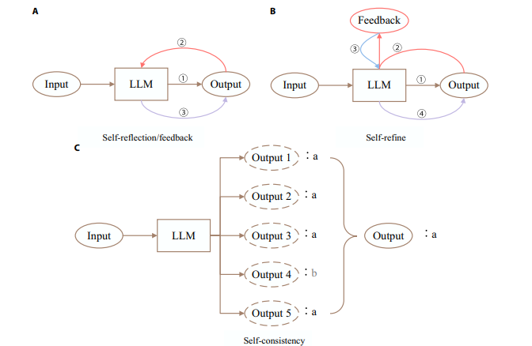

# シンプルなプロンプトだけでは、複雑なタスクにおけるLLMの潜在能力を十分に引き出せない

### 現状の課題
* LLMは多くのタスクで高い理解力と生成能力を発揮するが、多段階の分析を要する複雑なタスクでは、その能力を完全に活性化させることが困難である。
* 単一のプロンプト（Single prompt）ではモデルを正確に誘導できず、不正確な結果や論理的欠陥につながる可能性がある。

### 目指すべきゴール
* LLMのポテンシャルを最大限に探求し、活用すること。

---

# LLMの高度な推論を支える3つの柱

**第1の柱：段階的推論（Step-by-step reasoning）**
人間の思考プロセスを模倣し、問題を段階的に分解して解決する。

**第2の柱：自己改善（Self-improvement）**
フィードバックに基づき、出力を反復的に分析、評価、調整することで精度を向上させる。

**第3の柱：知識強化（Knowledge enhancement）**
内部・外部の知識源（Internal and External knowledge）にアクセスし、より情報に基づいたタスクプランニングを実現する。

---

# 【第1の柱】段階的推論（Step-by-step reasoning）は、人間の思考プロセスを模倣し、複雑な問題を解決可能にする

### Core Concept
問題を一度に解くのではなく、一歩ずつ段階的に対処するアプローチ。複雑なタスクをLLMが処理するための効果的な手法であり、高い解釈可能性（Interpretability）を提供する。

### Mechanism
* **思考の連鎖（Chain of Thought）** のように、最終的な答えを直接生成するのではなく、中間的な推論ステップを生成させる。
* これは、複雑な問題を一連の推論ステップに分解し、漸進的に解決するという人間の認知的問題解決手法から着想を得ている。
* 本質的には **「分割統治戦略（Divide-and-conquer strategy）」** であり、LLMが長い連鎖の依存関係を持つ推論タスクを解く際の難易度を効果的に低減する。

---

# 思考の連鎖（Chain of Thought）とその発展手法

### Core Technique: Chain of Thought (CoT) [Wei et al., 2022]
最終的な答えの前に中間的な推論ステップを生成させることで、タスクプランニングの最終解を導出する。

### Key Variants & Developments
* **Complex-CoT:** より多くの推論ステップを持つfew-shotプロンプトを選択することで性能を向上。
* **Zero-shot-CoT:** 「Let's think step by step.」というシンプルなプロンプトだけでfew-shot CoTに匹敵する性能を達成。
* **Auto-CoT:** クラスタリングで問題を分類し、各クラスターの代表的な問題に対してZero-shot-CoTで推論チェーンを生成し、few-shotプロンプトとして使用。
* **Plan-and-Solve:** タスクをサブタスクに分解し、Zero-shot-CoTよりも詳細な指示を与える。

---

# 推論構造の進化：一本の「鎖」から思考の「木」、そして「グラフ」へ

### Chain of Thought (CoT)
* 単一の推論経路。

### Tree of Thoughts (ToT) [Yao et al., 2023]
* CoTを拡張し、一本の推論経路を複数の経路に分岐させる。LLMは複数の推論経路の結果を統合して最終結論を得る。推論プロセスを木構造（Tree structure）でモデル化し、結果の追跡可能性などを実現するが、剛直な構造が推論能力を制限する。

### Graph of Thoughts (GoT) [Besta et al., 2023]
* 人間の脳の構造に着想を得て、任意のグラフ構造を形成可能に。思考を頂点（vertex）、依存関係を辺（edge）としてモデル化。複数の入力辺を持つ頂点を構築することで、多様な思考の集約を可能にし、CoTやToTをより複雑な推論パターンに一般化する。

---

## CoT/ToT/GoT

---

# 推論と行動の統合：環境との相互作用による動的プランニング

### Key Framework: ReAct [Yao et al., 2022]
推論（Reasoning）と行動（Action）をLLMと組み合わせる。動的な推論を実行し、行動計画を作成、維持、調整すると同時に、外部環境との相互作用をサポート。CoTが持つ「外部世界との接点がない」「知識を更新できない」という欠点を解消する。

### Further Developments in Tree-based Search
* **DFSDT:** 複数の推論経路を評価し、ステップを撤回したり有望な経路を進んだりする思慮深い決定が可能。
* **RadAgent:** Eloレーティングシステムに基づき内在化された効用関数を構築し、自律的な意思決定を促進。
* **CoAct:** 人間社会の階層的計画と協調モデル（Hierarchical planning and collaboration models）を導入（グローバルプランナーとローカルエグゼキューター）。
* **Least-to-most Prompting:** 複雑なタスクをより単純なサブタスクの連続に分解し、段階的に解決する。

---

# 【第2の柱】自己改善(Self-improvement)は、フィードバックのループを通じて精度と品質を向上させる

### Core Concept
LLMに複数回または反復的に結果を出力させ、最終結果の精度と全体的な品質を向上させるアプローチ。
この反復プロセスにより、LLMは提供されたフィードバックに基づいて自身の出力を分析、評価、調整することができる。
*(生成 → フィードバック提供 → 分析・評価 → 出力の改良)*

### Key Components for Success
1. **堅牢な評価基準 (Robust evaluation criteria):** LLMが望ましい目標と一致していることを保証する。
2. **高品質なフィードバック情報 (High-quality feedback):** 改善のための実行可能な洞察を提供する。

---

## overview

  
  

---

# 内部フィードバックによる自己改善：多数決と自己対話による精度向上

### Methods based on Multiple Outputs & Voting
* **Self-consistency:** 複数の推論経路と対応する回答を生成し、多数決で最終回答を決定。問題解決性能を大幅に向上させるが、トークン消費が増加する。
* **PREFER:** フィードバック・反映・改善のメカニズムを確立し、プロンプトを反復的に生成・改良する。

### Methods based on Self-Feedback & Refinement
* **Self-improve:** LLMがCoT推論とSelf-consistencyを用いて高信頼度の説明を生成し、それをファインチューニングのターゲット出力として使用。
* **Self-refine:** 反復的な自己フィードバックによる出力の最適化。LLMが自身の出力に対して多角的なフィードバックを生成し、それに基づいて出力を改良する。
* **Self-contrast:** 複数の解決策の視点を探索し、それらの違いを対比・分析。その要約をチェックリストとして用いて再評価を行う。

---

# 外部フィードバックによる自己改善：環境との対話を通じた学習と知識更新

### Using External Tools & Environment for Feedback (without updating the LLM)
* **CRITIC:** 外部ツールとの対話で得られた検証フィードバックを利用して出力を修正する（検証してから修正）。
* **Voyager:** 環境からのフィードバック、実行エラー、自己検証を統合した反復的なプロンプティングメカニズム。堅牢な生涯学習能力を示す。
* **Reflexion:** 従来の勾配更新におけるパラメータ信号を、言語的な要約に変換してコンテキストに追加。過去の失敗経験を次回の実行で参照できるようにする。

### Updating the LLM with Experience
* **LLaMA-Rider:** 環境からのフィードバックを利用して成功体験を収集し、それを教師ありデータセットに統合して自身の知識を学習・更新する。
* **Chain of Hindsight (CoH):** さまざまな種類のフィードバックを自然言語に変換し、LLMのファインチューニングに利用する。

---

# 【第3の柱】知識強化は、LLMが情報に効果的にアクセスし、タスクプランニングを強化する

### Core Concept
LLMが情報を効果的にアクセスし利用するための重要な手法。より目標指向のタスクプランニングを可能にする。

### Two Types of Knowledge
**内部知識 (Internal Knowledge)**
* **Source:** 主に過去の経験情報。タスクプランニング中に生成された推論データ。
* **Role:** LLM自身が内包する知識を反映する。

**外部知識 (External Knowledge)**
* **Source:** 外部の知識ベース（データベース、Web）から得られる情報。
* **Role:** LLMを最新の状態に保ち、専門分野の知識にアクセスし、内部知識のギャップを埋める。

---

# 外部知識活用の現在的パラダイム：検索拡張生成（RAG）

### Core Framework: Retrieval-Augmented Generation (RAG)
外部知識を実装するための現代的で効果的なアプローチ。
**プロセス:** ①Query → ②Retrieve → ③Augment → ④Generate

### Taxonomy of RAG (as per Gao et al. [45])
* Naive RAG
* Advanced RAG
* Modular RAG

### Core Components of RAG
* 🔍 **Retriever (検索器)**
* 🪄 **Generator (生成器)**
* 📄 **Augmentation Methods (拡張手法)**

---

# 内部知識の管理：過去の経験から学習し、行動を洗練させる

### Challenge
LLMのコンテキスト長の制限により、すべての履歴情報をプロンプトに入力することは非現実的。

**Generative Agents**
「メモリストリーム」としてエージェントの全経験を自然言語で記録。関連性、時間的近接性、重要性といった要素を考慮して情報を検索し、短期的な行動を導く。

**Ghost in the Minecraft (GITM)**
複数の成功したプログラムから必要な行動を要約し、参照情報として活用。成功した行動シーケンスをメモリに蓄積し、類似の目標に直面した際に参照プランとして利用。プランは継続的に更新され、より効果的になる。

**Diff History**
連続するテキスト観測にUnixの `diff` コマンドを適用することで、冗長な情報を排除し、環境の重要な変化を強調。トークン数を削減しつつ、より長い記憶の地平線を維持することを可能にする。

---

# 3つの柱の統合：相互に連携し、補完し合うことで相乗効果を生む

段階的推論、自己改善、知識強化は、孤立したアプローチではなく、相互に関連し補完し合う関係にある。

* **段階的推論** ↔ **知識強化**: 推論プロセスに情報を提供 ／ 新たな情報要求をトリガー
* **段階的推論** ↔ **自己改善**: 構造化された推論を提供
* **知識強化** ↔ **自己改善**: （情報の更新と洗練）

### Concrete Example
知識強化における **RAG** の使用は、LLMに最新かつ関連性の高い情報を提供する。その情報は、 **段階的推論** によって処理され、 **自己反省** とフィードバックメカニズムを通じて改善される。

---

# 残された課題と今後の展望

### Remaining Challenges
* **計算コスト (Computational Cost):** 特にSelf-consistencyのような複数の推論経路を生成する方法は、大量のトークンを消費し、リアルタイムアプリケーションには不向きな場合がある。
* **知識管理 (Knowledge Management):** 多様な知識源の統合と、時間経過に伴う知識の管理。LLMが動的な領域に適用されるにつれ、効率的な更新と利用が最重要となる。

### Future Research Directions
* **効率性と効果性の両立:** アルゴリズムやアーキテクチャの最適化。
* **高度な知識管理システム:** 様々なソースからの情報を動的に統合・更新できるシステムの開発。
* **マルチモーダル能力:** 異なる種類のデータを活用し、複雑な環境の理解と推論能力を向上させる。
* **ヒューマン・イン・ザ・ループ:** 特に精度と信頼性が重要な高リスク領域において、人間の専門知識を活用し、推論プロセスを誘導・検証する。

