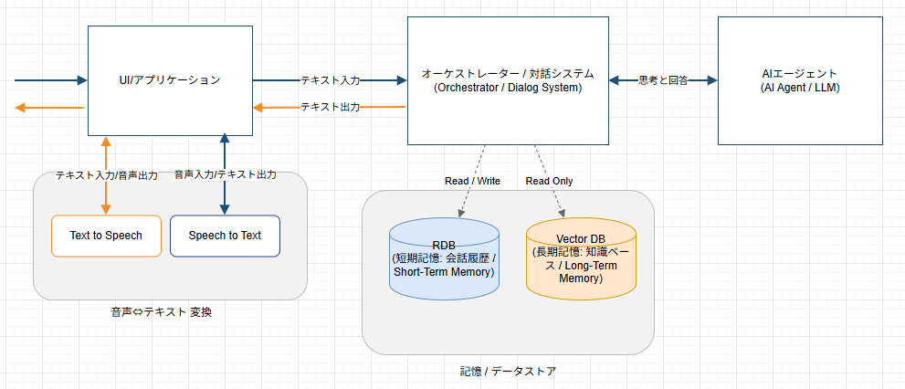

# CoAIに関する情報共有

## 目次
- 概要図
- 記憶（Memory）
  - 短期記憶
    - thread_id
    - DB設計
  - 長期記憶
- 音声⇔言語 変換（Speech to Text, Text to Speech）

---

# 概要図

---
## ※オーケストレーター、AIエージェント側の使用技術

- Python: 3.13系
- Dockerコンテナ
- LangChain, LangGraph（※バージョンは別途共有）
- FastAPI(オーケストレーター/対話システム), FastAPI+A2A(AIエージェント) 

※作業/役割分担は別途相談.

---
# 記憶（Memory）

## 短期記憶（Short-Term Memory）
- 概要: 現在の会話文脈や直近タスクに必要な情報を一時的に保持するメモリ
- 用途: 会話の整合性維持、直近の指示や条件の引き継ぎ、フォローアップ質問への対応
- 例: 直近数ターンの会話ログ、ユーザーの直前の要望、現在のタスク状態
- 技術的な方法（例）:
  - セッションメモリ（Redis等のKVストア）
  - コンテキスト要約の更新（短期要約）
  - 実行状態の永続化（例: **LangGraph Checkpoint**）

## 長期記憶（Long-Term Memory）
- 概要: 継続的に蓄積して、後から参照・検索できる知識や履歴のメモリ
- 用途: 継続的なユーザー嗜好の反映、過去の会話・決定の再利用、知識ベースの参照
- 例: ユーザープロファイル、過去のプロジェクト方針、FAQ/社内ナレッジ
- 技術的な方法（例）:
  - ベクトルDBによる類似検索（Embedding + ANN）
  - ナレッジグラフ、タグ/カテゴリ付け

---
# LangGraph Checkpoint

## Checkpointとは

- LangGraph 実行中の state（状態） を永続化する仕組み（スレッド継続・再開・デバッグに利用）
- 本番運用は Postgres を想定
- `thread_id` をキーに「会話/タスクの続き」を復元できるようにする

⇒ 本プロダクトでも現状は`langgraph-checkpoint-postgres` + `PostgresSaver/AsyncPostgresSaver` を使う予定.

## 依頼事項
- UI側でのthread_idの発行
  - 今回のプロダクトで要求されるUXに応じた、短期記憶の保存単位（thread_idの発行単位）の検討
- DBおよびDBメンテ用権限/環境の用意
  - `checkpointer.setup()`の実行経路の用意
  - JS/TS版も用意がある様子　※バージョン指定にご注意ください.
- 削除戦略/ポリシーの検討（Checkpointは蓄積し続けるため）
  - TTLで定期ジョブで削除(`delete_thread`を実行) などの検討

---
# 長期記憶（Long-term Memory）

## 方法例①：RAG型（過去会話・イベントを検索して持ってくる）

主な課題
- 精度：関連断片が安定して取れない／誤取得で逆に品質低下（“記憶のハルシネーション”）
- コスト：ログ量×埋め込み×インデックスでストレージ/運用が増えやすい
- 運用：更新・要約・重複排除・評価が難しい（何が効いたか測りづらい）
- リスク：プライバシー/機密の混入、削除要求対応（忘れる権利等）

## 方法例②：ユーザプロファイル型（構造化“事実”として保持）
- 保存：ユーザ属性/嗜好/制約/履歴の“抽出結果”を Profile Store に格納
- 格納先の一般的選択肢（用途で変わる） →現状未定.
  - RDB（例：Postgres/MySQL）…整合性・参照/更新・監査に強い
  - Document DB（例：MongoDB）…柔軟スキーマ、プロファイルが可変なとき
  - Key-Value（例：Redis/DynamoDB）…低遅延参照、セッション/設定の高速取得
  - Feature Store（ML/推薦寄り）…特徴量として管理・再利用

---
# 長期記憶（Long-term Memory）

## 結論（意思決定）
- 現状：目的・成功指標・保存対象（何を覚えるべきか）が未確定
- ⇒ RAG型もプロファイル型も、工数/コスト/リスクが先行しやすい
- ⇒ 技術難易度・運用負債（更新/削除/監査）に対して、ROI（ビジネスメリット）が現時点で見積もれない
  - 例：継続率/CS向上、対応工数削減、成約率改善などの 定量KPIとの紐付けが未確立
  - 取得精度の不安定さ・誤記憶リスクにより 逆効果（品質低下/問い合わせ増） の可能性もある
- ⇒ MVPでは長期記憶は実装しない
  - まずは短期記憶＋必要最小限の設定のみ
  - 以下が決まってから再検討
    - 要件（何をパーソナライズしたいのか）
    - 方法としての適切性（本当に長期記憶という方法が適切か、どのような記憶方法が良いか）
    - KPIや評価方法
  - ※基本的には短期記憶のみの場合に課題が出たタイミングでの再検討となる想定

---

# 音声⇔テキスト変換<small>（STT: Speech to Text, TTS: Text to Speech）</small>

※UI上でのON/OFF切り替え、API変更が必要になる印象.

## API例

