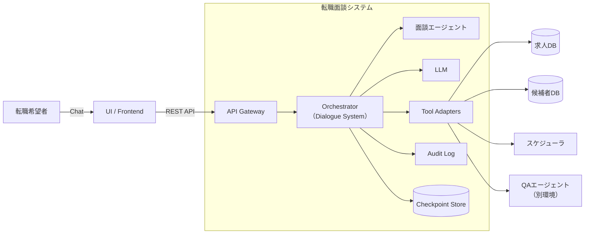

# Context & Scope（外部との境界）— 転職面談エージェント

対象：転職希望者との面談を行う対話システム（転職面談エージェント）  
担当：**バックエンド開発**（UI/フロントエンドは別チームが担当）  
想定：LangGraph / LLM / 外部ツール（求人DB・候補者DB・スケジューラ等）

## 1. 目的
- 本システム（バックエンド）の責任範囲（In/Out）と外部依存を明確化し、後続の設計（State/ノード/運用/テスト）の前提を固定する。

## 2. スコープ

### 2.1 In Scope（我々の担当）

#### 転職面談エージェント
- 転職希望者との対話処理（面談の実施）
- 希望条件のヒアリング・整理（職種/勤務地/年収/働き方等）
- 候補者情報の取得・参照（候補者DB）
- 求人情報の検索・提案（求人DB）
- 面談内容の要約・記録
- セッション状態の保持（Checkpoint）

#### QAエージェント連携
- QAエージェント（別環境構築）へのリクエスト転送
- QAレスポンスの受信・統合

#### 共通基盤
- API提供（UIチームへのインターフェース）
- 監査ログ
- LLMオーケストレーション

### 2.2 Out of Scope（担当外）
- **UI/フロントエンド開発**（別チームが担当）
- **QAエージェント本体**（別環境で構築、本システムから接続）
- 最終的な採用可否判断（必ず人間が決定）
- 求人DB/候補者DBのデータ品質保証・編集機能
- 認証基盤の提供（既存IdPに依存）

## 3. アクター（利用者）
- **転職希望者**（面談対象者）
- **キャリアアドバイザー**（人間担当者：引継ぎ対応・最終判断）
- **Admin**（管理者：設定・監査・運用）
- **UIチーム**（別チーム：フロントエンド開発者）

## 4. 技術コンテキスト（境界図）

| 外部要素 | 目的 | 方式 | データ分類 | 主要制約/注意 | 失敗時の基本方針 |
| --- | --- | --- | --- | --- | --- |
| UI/Frontend | 入出力（別チーム） | REST API | PII含む | API仕様の合意 | エラーレスポンス返却 |
| Auth/IdP | 認証/認可 | OIDC/SAML | 個人情報 | トークン期限/権限 | 再認証 |
| 候補者DB | 希望者情報参照 | REST/DB | **PII高** | 最小権限/監査 | 参照不可として継続 |
| 求人DB | 求人検索・提案 | Search/REST | 企業機密 | 更新頻度/検索品質 | 不確実性明示＋人へ |
| スケジューラ | 面談日程調整 | REST | 連絡先PII | 空き枠確認 | 手動対応へ誘導 |
| Notification | 通知 | API | 連絡先PII | 送信失敗/再送 | キュー化/後送 |

