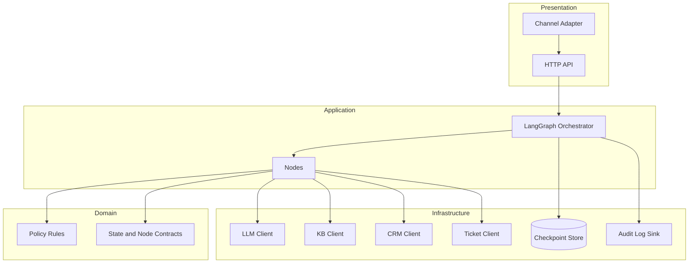

# Building Blocks（箱と責務）
対象：Dialogue System（LangGraph）


## 1. コンポーネント構成


## 2. ノード一覧（責務）
| Node              | 役割                 | 外部I/O     |
| ----------------- | ------------------ | --------- |
| intake_node       | 入力正規化、意図分類、スロット抽出  | LLM       |
| policy_node       | 禁止/要注意/PII判定、ルール適用 | LLM + ルール |
| clarify_node      | 不足情報の確認質問生成        | LLM       |
| retrieve_kb_node  | FAQ/手順検索           | KB        |
| retrieve_crm_node | 顧客情報参照（必要時）        | CRM       |
| compose_node      | 根拠付き回答生成           | LLM       |
| ticket_node       | 人手エスカレーション用起票      | Ticket    |
| fallback_node     | 縮退応答（安全・簡易）        | LLM/テンプレ  |


## 3. ディレクトリ例（DDD/Ports & Adapters寄り）

```
/
├─ domain/              # ルール・値オブジェクト（LLM/DB非依存）
├─ application/         # ユースケース（オーケストレーション方針）
├─ infrastructure/      # 外部I/O（KB/CRM/Ticket/LLM/DB）
├─ presentation/        # API/チャネルアダプタ
├─ graphs/              # LangGraph定義（state/edges/checkpoint）
├─ prompts/             # system/dev/userテンプレ
└─ tests/               # シナリオ（golden）中心
```

