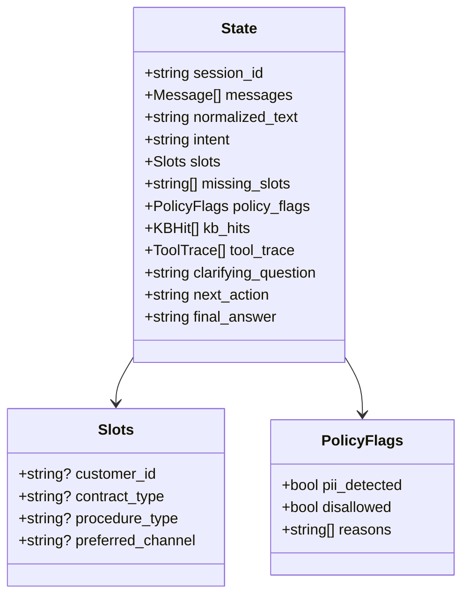

# State Spec（Stateの契約）
対象：Dialogue System（LangGraph）

---

## 1. Stateスキーマ（概念図）

## 2. フィールド仕様（抜粋）

### messages
- **type**: `list[Message]`
- **meaning**: 会話履歴（user / assistant / tool）
- **written_by**: all nodes（append）
- **persist**: YES
- **invariants**
  - PIIはマスキング済みのみ保存
  - tool結果全文を保存しない（要約＋参照ID）

### intent
- **type**: `Literal["FAQ","PROCEDURE","ACCOUNT","UNKNOWN"]`
- **written_by**: intake_node
- **persist**: YES
- **invariants**
  - `UNKNOWN` の場合は clarify へ誘導する

### slots
- **type**: `Slots`
- **meaning**: タスク遂行に必要な構造化情報
- **written_by**: intake_node / clarify_node
- **persist**: YES
- **invariants**
  - `intent = "PROCEDURE"` の場合、`procedure_type` は必須（例）

### tool_trace
- **type**: `list[ToolTrace]`
- **meaning**: ツール実行の監査・再現用ログ（要約）
- **written_by**: tool nodes（append）
- **persist**: YES（監査要件次第）
- **invariants**
  - PII/機密はマスキング
  - 出力は要約のみ（全文保存しない）
