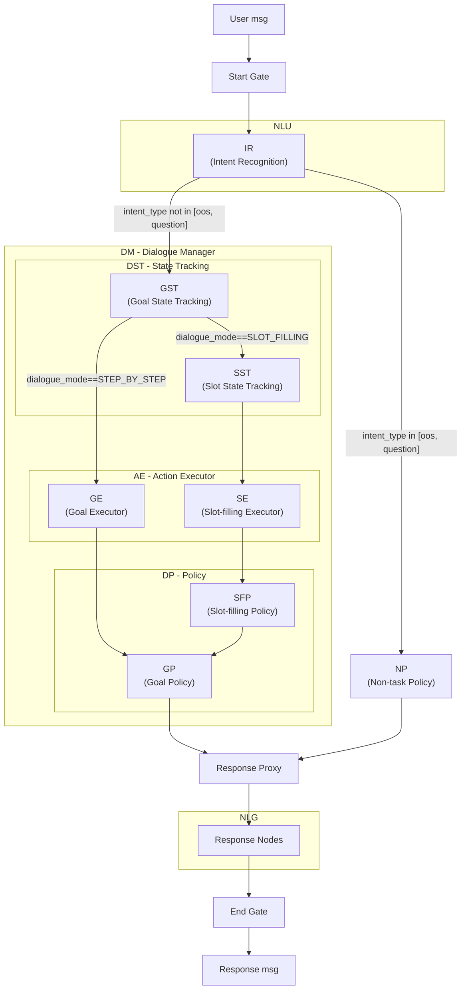
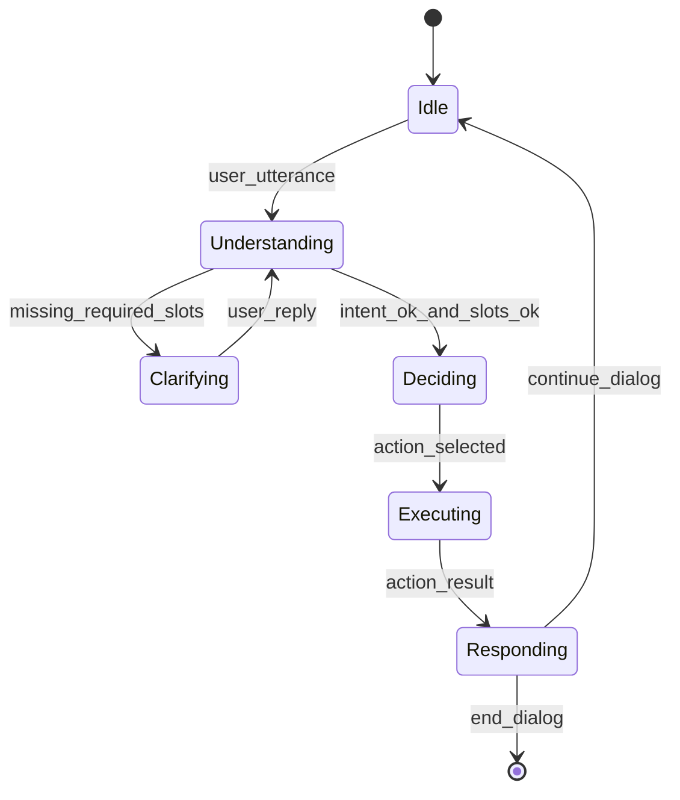
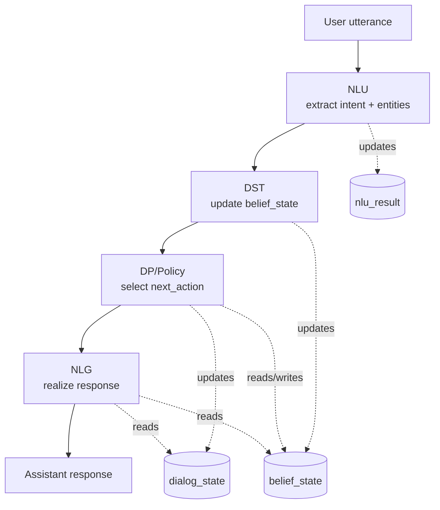
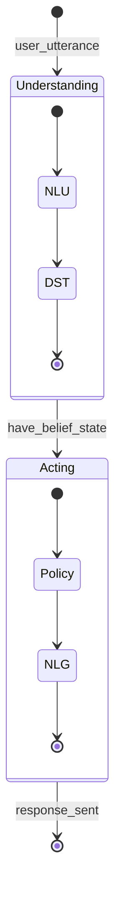
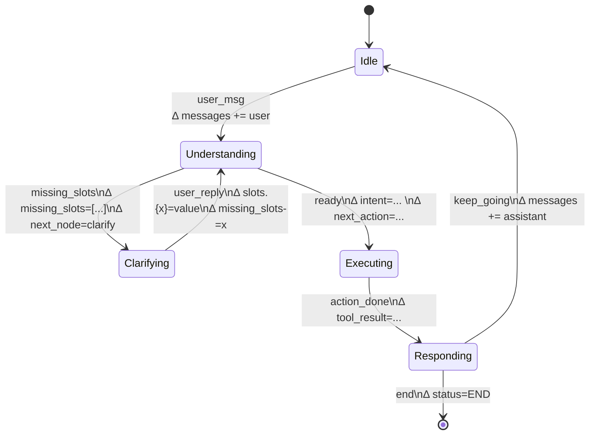
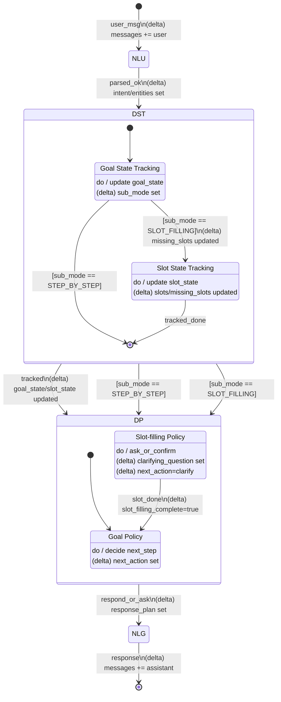
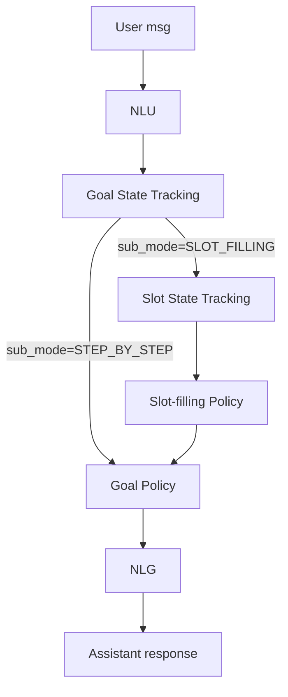

```mermaid
flowchart TD
  U[User msg]

  subgraph NLU["NLU"]
    IR["IR<br/>(Intent Recognition)"]
  end

  subgraph DM["DM - Dialogue Manager"]
    subgraph DST["DST - State Tracking"]
      GST["GST<br/>(Goal State Tracking)"]
      SST["SST<br/>(Slot State Tracking)"]
    end

    subgraph AE["AE - Action Executor"]
      SE["SE<br/>(Slot-filling Executor)"]
      GE["GE<br/>(Goal Executor)"]
    end

    subgraph DP["DP - Policy"]
      SFP["SFP<br/>(Slot-filling Policy)"]
      GP["GP<br/>(Goal Policy)"]
    end
  end

  U --> SG[Start Gate]
  SG --> IR
  IR --> |"intent_type not in [oos, question]"|GST
  IR -->|"intent_type in [oos, question]"| NP["NP<br/>(Non-task Policy)"]
  GST -->|"dialogue_mode==SLOT_FILLING"| SST
  GST -->|"dialogue_mode==STEP_BY_STEP"| GE
  SST --> SE
  SE --> SFP
  GE --> GP
  SFP --> GP
  GP --> RP[Response Proxy]
  NP --> RP
  RP --> RN
  subgraph NLG["NLG"]
    RN["Response Nodes"]
  end
  RN --> EG[End Gate]
  EG --> R[Response msg]

```

---

```mermaid
stateDiagram-v2
  [*] --> Idle

  Idle --> Understanding: user_utterance
  Understanding --> Clarifying: missing_required_slots
  Understanding --> Deciding: intent_ok_and_slots_ok

  Clarifying --> Understanding: user_reply

  Deciding --> Executing: action_selected
  Executing --> Responding: action_result

  Responding --> Idle: continue_dialog
  Responding --> [*]: end_dialog

```
---

```mermaid
flowchart TD
  U[User utterance] --> NLU[NLU<br/>extract intent + entities]
  NLU --> DST[DST<br/>update belief_state]
  DST --> DP[DP/Policy<br/>select next_action]
  DP --> NLG[NLG<br/>realize response]
  NLG --> R[Assistant response]

  %% state updates (dashed)
  NLU -. updates .-> S1[(nlu_result)]
  DST -. updates .-> S2[(belief_state)]
  DP  -. reads/writes .-> S2
  DP  -. updates .-> S3[(dialog_state)]
  NLG -. reads .-> S3
  NLG -. reads .-> S2

```

```mermaid
stateDiagram-v2
  state Understanding {
    [*] --> NLU
    NLU --> DST
    DST --> [*]
  }

  state Acting {
    [*] --> Policy
    Policy --> NLG
    NLG --> [*]
  }

  [*] --> Understanding: user_utterance
  Understanding --> Acting: have_belief_state
  Acting --> [*]: response_sent

```

```mermaid
stateDiagram-v2
  [*] --> Idle

  Idle --> Understanding: user_msg<br/>Δ messages += user

  Understanding --> Clarifying: missing_slots\nΔ missing_slots=[...]\nΔ next_node=clarify
  Clarifying --> Understanding: user_reply\nΔ slots.{x}=value\nΔ missing_slots-=x

  Understanding --> Executing: ready\nΔ intent=... \nΔ next_action=...
  Executing --> Responding: action_done\nΔ tool_result=...
  Responding --> Idle: keep_going\nΔ messages += assistant
  Responding --> [*]: end\nΔ status=END

```

```mermaid
stateDiagram-v2
  [*] --> NLU: user_msg\n(delta) messages += user

  NLU --> DST: parsed_ok\n(delta) intent/entities set

  state DST {
    [*] --> GST

    GST: Goal State Tracking
    GST: do / update goal_state\n(delta) sub_mode set

    GST --> SST: [sub_mode == SLOT_FILLING]\n(delta) missing_slots updated
    GST --> [*]: [sub_mode == STEP_BY_STEP]

    SST: Slot State Tracking
    SST: do / update slot_state\n(delta) slots/missing_slots updated

    SST --> [*]: tracked_done
  }

  DST --> DP: tracked\n(delta) goal_state/slot_state updated

  state DP {
    [*] --> GP

    GP: Goal Policy
    GP: do / decide next_step\n(delta) next_action set

    %% Slot-filling branch enters via entry-point (conceptual)
    SFP: Slot-filling Policy
    SFP: do / ask_or_confirm\n(delta) clarifying_question set\n(delta) next_action=clarify

    SFP --> GP: slot_done\n(delta) slot_filling_complete=true
  }

  %% Routing into DP
  DST --> DP: [sub_mode == STEP_BY_STEP]
  DST --> DP: [sub_mode == SLOT_FILLING]

  %% If SLOT_FILLING, conceptually start with SFP then GP
  DP --> NLG: respond_or_ask\n(delta) response_plan set

  NLG --> [*]: response\n(delta) messages += assistant


```

```mermaid
flowchart TD
  U[User msg] --> NLU[NLU]

  NLU --> GST[Goal State Tracking]

  GST -->|sub_mode=SLOT_FILLING| SST[Slot State Tracking]
  GST -->|sub_mode=STEP_BY_STEP| GP[Goal Policy]

  SST --> SFP[Slot-filling Policy]
  SFP --> GP[Goal Policy]

  GP --> NLG[NLG]
  NLG --> R[Assistant response]

```

---

