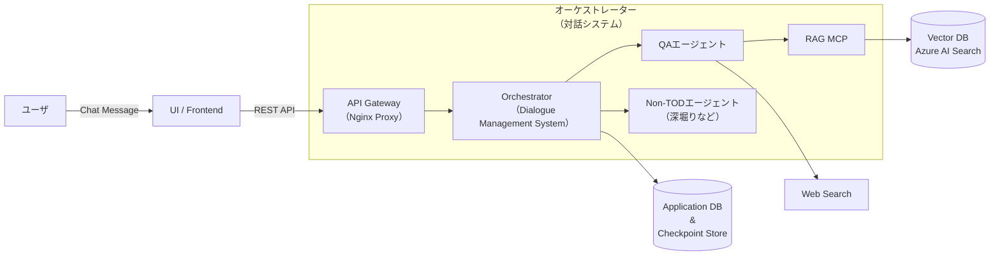
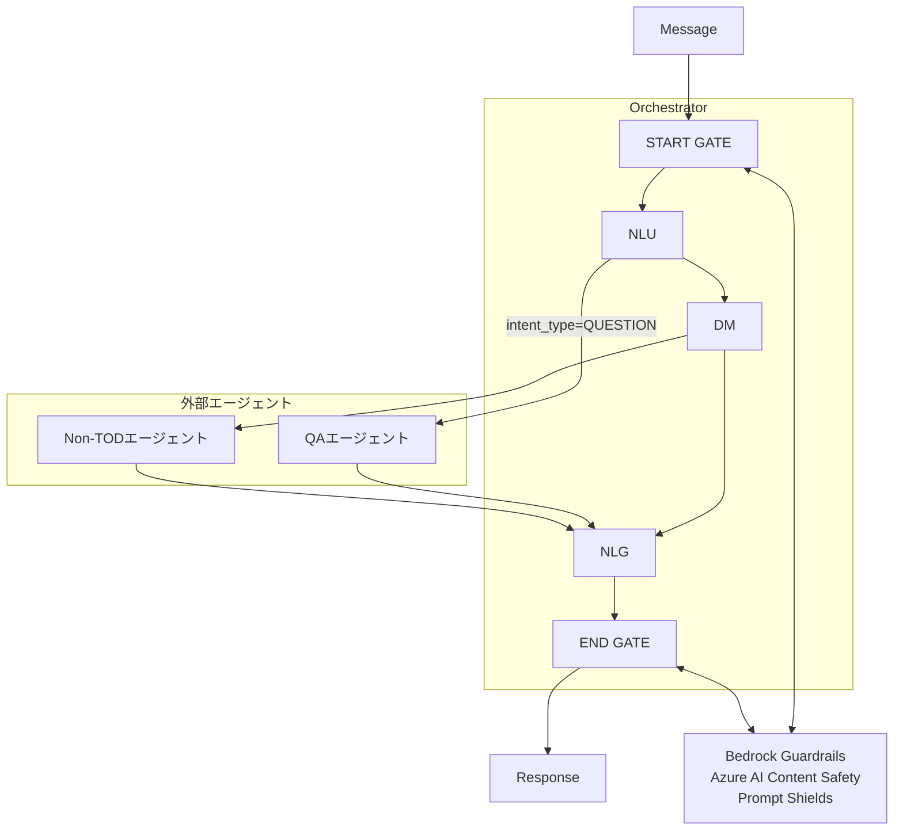

# アーキテクチャ設計詳細

## 1. システムアーキテクチャ

> ※実際のアーキテクチャはインフラ側のドキュメントを正とする。  
下記は主にオーケストレーター周りの機能分解／データフローイメージのための図とする。

## 2. システム構成 (Architecture)
本システムは、パイプライン方式の対話アーキテクチャを採用。

### A. NLU (Natural Language Understanding: 自然言語理解)
- **役割**: ユーザーの発話から「意図（Intent）」を抽出するなど発話を理解する。

### B. DM (Dialogue Management: 対話管理)
対話の進捗と履歴を管理し、次にシステムが取るべき行動を決定する。
- **DST (Dialogue State Tracking)**: 過去のやり取りを含めた「対話状態」を更新・保持する。
- **DAE (Dialogue Act Executor)**: 現在の状態に基づく、特定の「行動」を実行する。
- **DP (Dialogue Policy)**: 現在の状態に基づき、最適な「対話戦略（応答の種類）」を選択する。

### C. NLG (Natural Language Generation: 自然言語生成)
- **役割**: NLU・DMの処理結果、特にDPの指示に応じたレスポンスメッセージを生成する。

## 3. Orchectrator（Dialogue Management System）概念図

※ヒアリング内容（スロット充填後のState.slots）が曖昧な場合にNon-TODエージェントに投げる。  
※NLUで判定するか、DMで判定するかは要検討。

