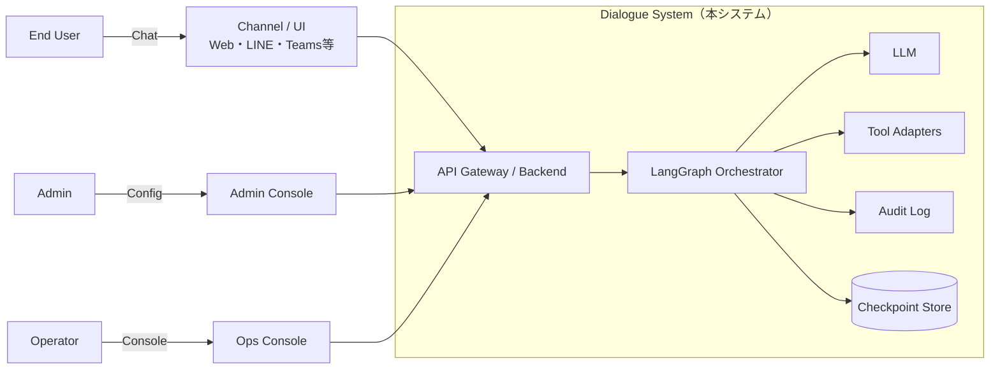

# Context & Scope（外部との境界）— Dialogue System
対象：タスク志向の対話システム（FAQ回答／手続き案内／チケット起票）  
想定：LangGraph / LLM / 外部ツール（KB・CRM・Ticket）

## 1. 目的
- 本システムの責任範囲（In/Out）と外部依存を明確化し、後続の設計（State/ノード/運用/テスト）の前提を固定する。

## 2. スコープ
### 2.1 In Scope
- チャネルからのメッセージ受領と応答生成
- 意図分類、確認質問、スロット充填（対話制御）
- FAQ/手順検索（KB）、必要に応じた顧客情報参照（CRM）
- 解決不能時のチケット起票（Ticketing）と人手エスカレーション
- 監査ログ、セッション状態の保持（Checkpoint）

### 2.2 Out of Scope
- 返金可否などの最終意思決定（必ず人間承認）
- CRM/KBのデータ品質保証・編集機能
- 認証基盤の提供（既存IdPに依存）
- 高度な推薦モデル構築（検索＋ルール＋LLMで開始）

## 3. アクター（利用者）
- End User（顧客）
- Operator（オペレーター：引継ぎ対応）
- Admin（管理者：設定・監査・運用）

## 4. 技術コンテキスト（境界図）

| 外部要素         | 目的     | 方式           | データ分類    | 主要制約/注意     | 失敗時の基本方針   |
| ------------ | ------ | ------------ | -------- | ----------- | ---------- |
| Channel/UI   | 入出力    | Webhook/REST | PII含む可能性 | UI制約/文字数/改行 | エラー文＋再入力誘導 |
| Auth/IdP     | 認証/認可  | OIDC/SAML    | 個人情報     | トークン期限/権限   | 再認証        |
| CRM          | 顧客参照   | REST/DB      | **PII高** | 最小権限/監査     | 参照不可として継続  |
| KB           | FAQ/手順 | Search/REST  | 公開〜機密    | 更新頻度/検索品質   | 不確実性明示＋人へ  |
| Ticketing    | 起票/引継ぎ | REST         | 機密       | 二重起票防止      | 冪等＋リトライ    |
| Notification | 通知     | API          | 連絡先PII   | 送信失敗/再送     | キュー化/後送    |

