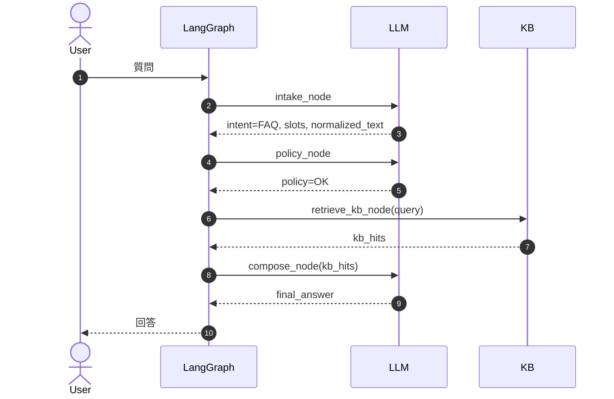
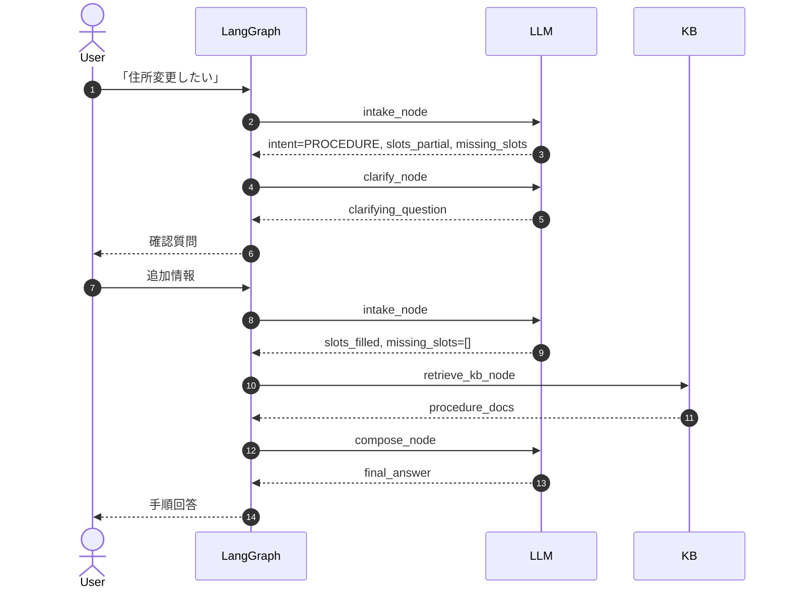
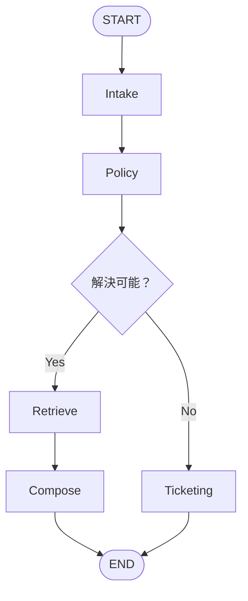
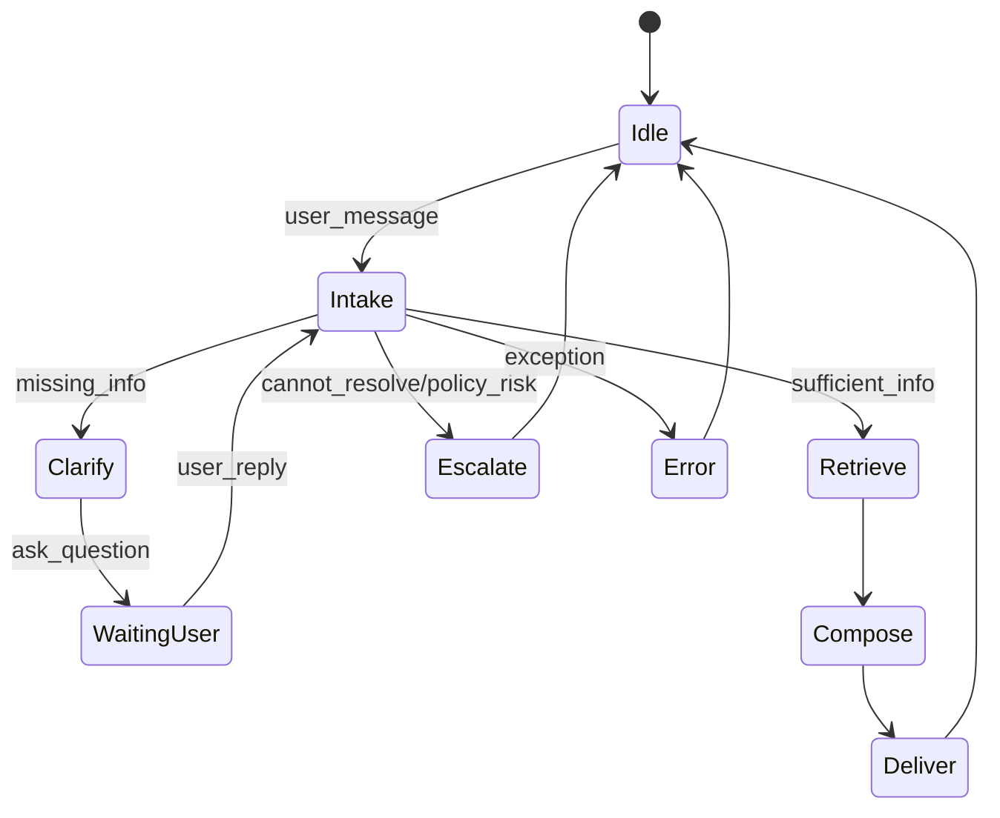

# Runtime View（代表シナリオ＋State変化）
対象：Dialogue System（LangGraph）

---

## UC-01: FAQ回答（情報十分 → KB検索 → 回答）

## State差分（例）
| Step | Node             | Writes（更新）                                |
| ---: | ---------------- | ----------------------------------------- |
|    1 | intake_node      | normalized_text, intent, slots, messages+ |
|    2 | policy_node      | policy_flags, messages+                   |
|    3 | retrieve_kb_node | kb_hits, tool_trace+                      |
|    4 | compose_node     | final_answer, messages+                   |

## UC-02: 手続き案内（不足確認 → 手順提示）

## UC-03: 解決不能 → チケット起票

## 会話状態遷移（Lifecycle）

