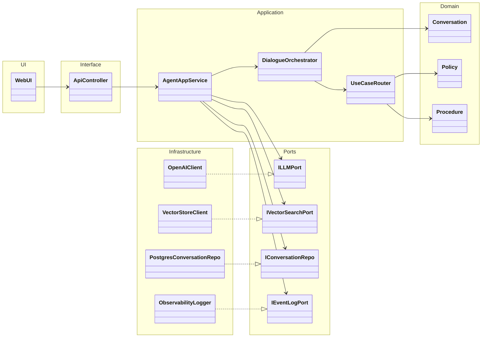
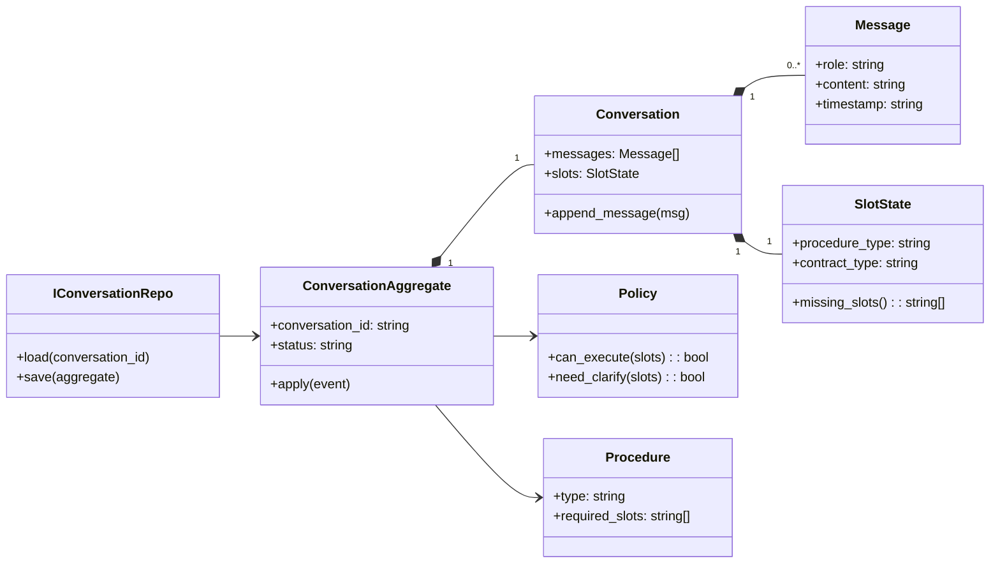
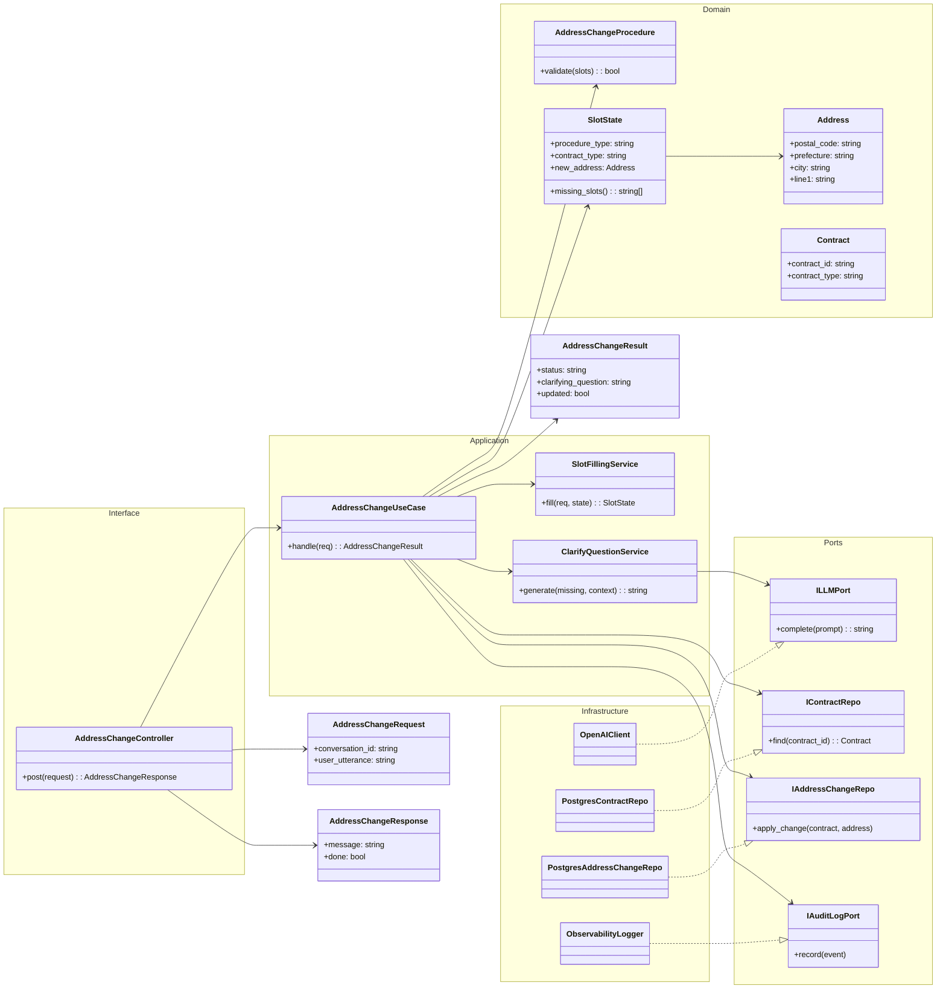

```mermaid
classDiagram
direction LR

namespace UI {
  class WebUI
}

namespace Interface {
  class ApiController
}

namespace Application {
  class AgentAppService
  class DialogueOrchestrator
  class UseCaseRouter
}

namespace Domain {
  class Conversation
  class Policy
  class Procedure
}

namespace Ports {
  class ILLMPort
  class IVectorSearchPort
  class IConversationRepo
  class IEventLogPort
}

namespace Infrastructure {
  class OpenAIClient
  class VectorStoreClient
  class PostgresConversationRepo
  class ObservabilityLogger
}

WebUI --> ApiController
ApiController --> AgentAppService

AgentAppService --> DialogueOrchestrator
DialogueOrchestrator --> UseCaseRouter
UseCaseRouter --> Policy
UseCaseRouter --> Procedure
DialogueOrchestrator --> Conversation

AgentAppService --> ILLMPort
AgentAppService --> IVectorSearchPort
AgentAppService --> IConversationRepo
AgentAppService --> IEventLogPort

OpenAIClient ..|> ILLMPort
VectorStoreClient ..|> IVectorSearchPort
PostgresConversationRepo ..|> IConversationRepo
ObservabilityLogger ..|> IEventLogPort
```

```mermaid
classDiagram
direction LR

class ConversationAggregate {
  +conversation_id: string
  +status: string
  +apply(event)
}

class Conversation {
  +messages: Message[]
  +slots: SlotState
  +append_message(msg)
}

class Message {
  +role: string
  +content: string
  +timestamp: string
}

class SlotState {
  +procedure_type: string
  +contract_type: string
  +missing_slots(): string[]
}

class Policy {
  +can_execute(slots): bool
  +need_clarify(slots): bool
}

class Procedure {
  +type: string
  +required_slots: string[]
}

class IConversationRepo {
  +load(conversation_id)
  +save(aggregate)
}

ConversationAggregate "1" *-- "1" Conversation
Conversation "1" *-- "0..*" Message
Conversation "1" *-- "1" SlotState

ConversationAggregate --> Policy
ConversationAggregate --> Procedure

IConversationRepo --> ConversationAggregate
```

```mermaid
classDiagram
direction LR

namespace Interface {
  class AddressChangeController {
    +post(request): AddressChangeResponse
  }
}

namespace Application {
  class AddressChangeUseCase {
    +handle(req): AddressChangeResult
  }

  class SlotFillingService {
    +fill(req, state): SlotState
  }

  class ClarifyQuestionService {
    +generate(missing, context): string
  }
}

namespace Domain {
  class AddressChangeProcedure {
    +validate(slots): bool
  }

  class Address {
    +postal_code: string
    +prefecture: string
    +city: string
    +line1: string
  }

  class Contract {
    +contract_id: string
    +contract_type: string
  }

  class SlotState {
    +procedure_type: string
    +contract_type: string
    +new_address: Address
    +missing_slots(): string[]
  }
}

namespace Ports {
  class ILLMPort {
    +complete(prompt): string
  }

  class IContractRepo {
    +find(contract_id): Contract
  }

  class IAddressChangeRepo {
    +apply_change(contract, address)
  }

  class IAuditLogPort {
    +record(event)
  }
}

namespace Infrastructure {
  class OpenAIClient
  class PostgresContractRepo
  class PostgresAddressChangeRepo
  class ObservabilityLogger
}

class AddressChangeRequest {
  +conversation_id: string
  +user_utterance: string
}

class AddressChangeResult {
  +status: string
  +clarifying_question: string
  +updated: bool
}

class AddressChangeResponse {
  +message: string
  +done: bool
}

AddressChangeController --> AddressChangeUseCase
AddressChangeUseCase --> SlotFillingService
AddressChangeUseCase --> ClarifyQuestionService
AddressChangeUseCase --> AddressChangeProcedure

AddressChangeUseCase --> IContractRepo
AddressChangeUseCase --> IAddressChangeRepo
AddressChangeUseCase --> IAuditLogPort

ClarifyQuestionService --> ILLMPort

AddressChangeUseCase --> SlotState
SlotState --> Address

OpenAIClient ..|> ILLMPort
PostgresContractRepo ..|> IContractRepo
PostgresAddressChangeRepo ..|> IAddressChangeRepo
ObservabilityLogger ..|> IAuditLogPort

AddressChangeController --> AddressChangeRequest
AddressChangeController --> AddressChangeResponse
AddressChangeUseCase --> AddressChangeResult
```
