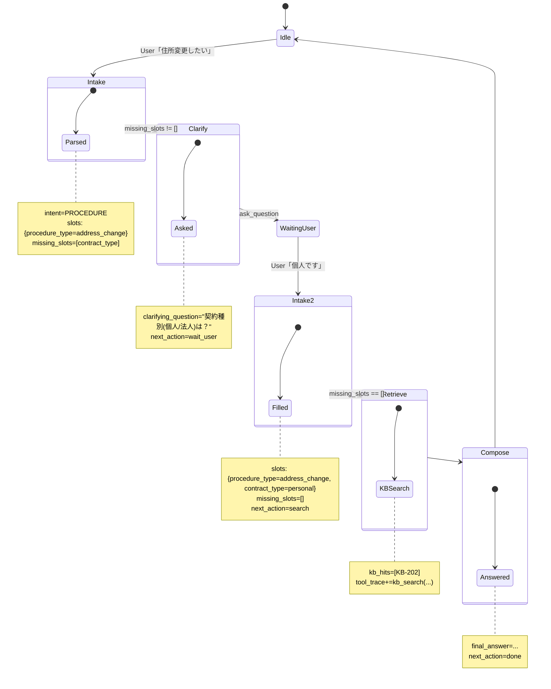
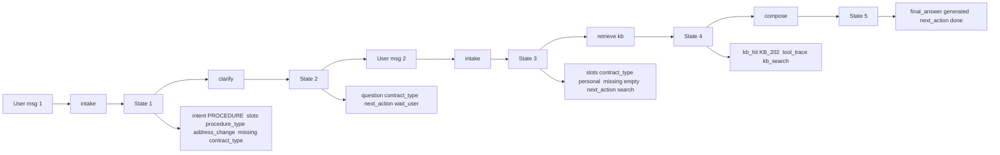
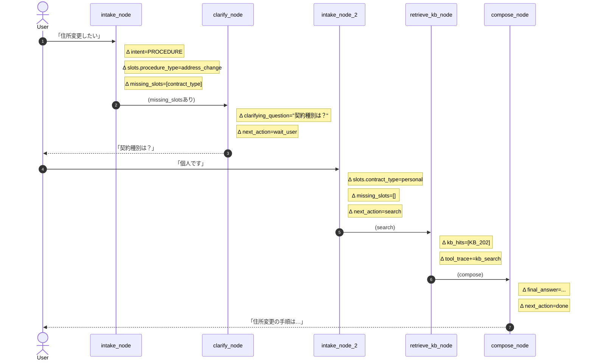

```mermaid
stateDiagram-v2
  [*] --> Idle

  Idle --> Intake: User「住所変更したい」

  state Intake {
    [*] --> Parsed
    note right of Parsed
      intent=PROCEDURE
      slots: {procedure_type=address_change}
      missing_slots=[contract_type]
    end note
  }

  Intake --> Clarify: missing_slots != []
  state Clarify {
    [*] --> Asked
    note right of Asked
      clarifying_question="契約種別(個人/法人)は？"
      next_action=wait_user
    end note
  }

  Clarify --> WaitingUser: ask_question
  WaitingUser --> Intake2: User「個人です」

  state Intake2 {
    [*] --> Filled
    note right of Filled
      slots: {procedure_type=address_change, contract_type=personal}
      missing_slots=[]
      next_action=search
    end note
  }

  Intake2 --> Retrieve: missing_slots == []
  state Retrieve {
    [*] --> KBSearch
    note right of KBSearch
      kb_hits=[KB-202]
      tool_trace+=kb_search(...)
    end note
  }

  Retrieve --> Compose
  state Compose {
    [*] --> Answered
    note right of Answered
      final_answer=...
      next_action=done
    end note
  }

  Compose --> Idle
```
---

```mermaid
graph LR
  U1["User msg 1"] --> N1["intake"]
  N1 --> S1["State 1"]
  S1 --> N2["clarify"]
  N2 --> S2["State 2"]
  S2 --> U2["User msg 2"]
  U2 --> N3["intake"]
  N3 --> S3["State 3"]
  S3 --> N4["retrieve kb"]
  N4 --> S4["State 4"]
  S4 --> N5["compose"]
  N5 --> S5["State 5"]

  S1 --> D1["intent PROCEDURE  slots procedure_type address_change  missing contract_type"]
  S2 --> D2["question contract_type  next_action wait_user"]
  S3 --> D3["slots contract_type personal  missing empty  next_action search"]
  S4 --> D4["kb_hit KB_202  tool_trace kb_search"]
  S5 --> D5["final_answer generated  next_action done"]

```
---

```mermaid
sequenceDiagram
  autonumber
  actor U as User
  participant N1 as intake_node
  participant N2 as clarify_node
  participant N3 as intake_node_2
  participant N4 as retrieve_kb_node
  participant N5 as compose_node

  U->>N1: 「住所変更したい」
  Note right of N1: Δ intent=PROCEDURE
  Note right of N1: Δ slots.procedure_type=address_change
  Note right of N1: Δ missing_slots=[contract_type]

  N1->>N2: (missing_slotsあり)
  Note right of N2: Δ clarifying_question="契約種別は？"
  Note right of N2: Δ next_action=wait_user
  N2-->>U: 「契約種別は？」

  U->>N3: 「個人です」
  Note right of N3: Δ slots.contract_type=personal
  Note right of N3: Δ missing_slots=[]
  Note right of N3: Δ next_action=search

  N3->>N4: (search)
  Note right of N4: Δ kb_hits=[KB_202]
  Note right of N4: Δ tool_trace+=kb_search

  N4->>N5: (compose)
  Note right of N5: Δ final_answer=...
  Note right of N5: Δ next_action=done
  N5-->>U: 「住所変更の手順は…」


```
