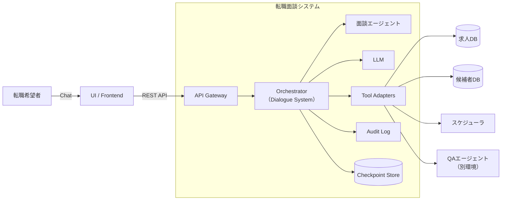

# アーキテクチャ設計詳細

## 1. 処理フロー
1. **Entrypoint**: `main.py` がリクエストを受け取る。
2. **NLU**: 発話を解析し、IntentとEntityを抽出。
3. **DM (DST)**: 解析結果に基づき、現在の `DialogueState` を更新。
4. **DM (DP)**: 更新された状態から、次にシステムが取るべき `Action` を決定。
5. **NLG**: `Action` をもとに自然な日本語文を生成し、ユーザーへ返却。

## 2. 詳細ディレクトリ構造
AIはこの構造を逸脱してファイルを生成してはいけません。

```text
src/
├── core/               # 共通基盤（設定、ベースクラス）
├── nlu/
│   ├── parser.py       # 発話解析ロジック
│   └── models.py       # 解析結果のデータ型
├── dm/
│   ├── state_tracker.py # DST: 状態管理
│   ├── policy.py       # DP: 行動決定
│   └── state.py        # 対話ステートの定義
├── nlg/
│   └── generator.py    # 応答生成ロジック
└── api/                # FastAPIのルーティング

### 4. データスキーマ定義 (`docs/schema.md`)
AIが最もミスをしやすい「各モジュール間のデータの受け渡し」を定義します。
```

---
## 3. アーキテクチャ

