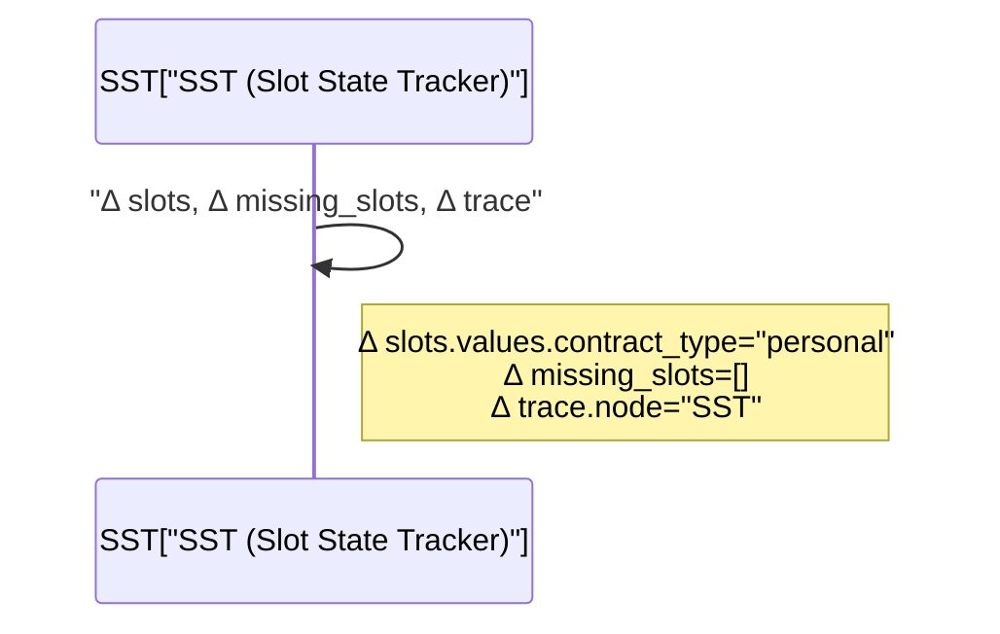
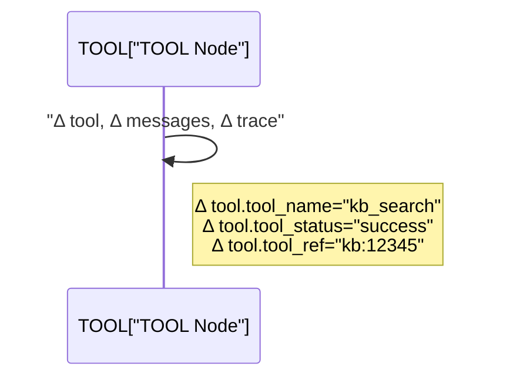

# 03_STATE_SPEC - Dialogue System Design Pack
本章は **LangGraph State（状態）** の仕様です。  
**「Stateキー＝共通言語」** として、ノード間の契約（R/W）・ログ・テスト・運用の基準になります。  
※本章は **常に更新（Living Spec）** される前提です（変更は 99_DECISIONS_LOG.md に必ず追記）。

---

## 1. Purpose（この章の目的）
- LangGraphの State を **型・意味・初期値・更新ルール** まで含めて定義する
- ノード仕様（06）・DMフロー（05）・ログ（14）・テスト（15）に対して **唯一の参照点** を提供する
- State肥大化/PII混入/責務漏れを防ぐ

---

## 2. Principles（基本原則）
1) **State中心**：ノードは State を読み、差分（Δ）を書き戻す  
2) **差分更新**：ノードは `Δ`（Partial Update）のみ返し、オーケストレーターがマージする  
3) **小さく保つ**：外部データ全文は保持せず、要約＋参照IDを原則  
4) **PII最小化**：PIIは保存しない/マスクして保存（方針は13）  
5) **観測しやすく**：ログに出す項目（抜粋）をState側で固定する（14）

---

## 3. State Schema（全体像）
> 実装は `TypedDict` / `Pydantic` 等。ここでは概念設計（キー・型）を確定する。

```mermaid
classDiagram
  class DSState["DSState<br/>LangGraph State"]{
    +string session_id
    +string turn_id
    +Message[] messages
    +Intent intent
    +DialogueMode dialogue_mode
    +Policy policy
    +Goal goal
    +Slots slots
    +string[] missing_slots
    +Plan plan
    +ToolContext tool
    +Response response
    +Trace trace
    +ErrorInfo last_error
  }

  class Intent["Intent"]{
    +string intent_type
    +float confidence
    +string[] candidates
  }

  class Policy["Policy"]{
    +bool disallowed
    +bool pii_detected
    +string[] reasons
    +string risk_level
  }

  class Goal["Goal"]{
    +string goal_type
    +string goal_text
    +string status
  }

  class Slots["Slots"]{
    +string procedure_type
    +string contract_type
    +string customer_id
    +dict values
  }

  class Plan["Plan"]{
    +string[] steps
    +string next_action
    +dict params
  }

  class ToolContext["ToolContext"]{
    +string tool_name
    +dict tool_input
    +dict tool_output_summary
    +string tool_status
    +string tool_ref
  }

  class Response["Response"]{
    +string message
    +string[] citations
    +string followup_question
    +string response_type
  }

  class Trace["Trace"]{
    +string node
    +string action
    +int latency_ms
    +string outcome
    +dict metrics
  }

  class ErrorInfo["ErrorInfo"]{
    +string error_type
    +string message
    +string node
    +string time_iso
  }

  DSState --> Intent
  DSState --> Policy
  DSState --> Goal
  DSState --> Slots
  DSState --> Plan
  DSState --> ToolContext
  DSState --> Response
  DSState --> Trace
  DSState --> ErrorInfo
````

---

## 4. State Keys（キー一覧・型・意味・初期値）

> 形式：**Key / Type / Meaning / Initial / Notes**

### 4.1 Session / Turn

| Key          | Type  | Meaning  | Initial | Notes         |
| ------------ | ----- | -------- | ------- | ------------- |
| `session_id` | `str` | セッション識別子 | 外部から注入  | 監査・復元キー       |
| `turn_id`    | `str` | ターン識別子   | 自動採番    | 1ユーザー発話=1turn |

### 4.2 Messages

| Key        | Type            | Meaning                   | Initial | Notes                 |
| ---------- | --------------- | ------------------------- | ------- | --------------------- |
| `messages` | `list[Message]` | 会話履歴（user/assistant/tool） | `[]`    | reducerで append（下記参照） |

### 4.3 NLU / DM Core

| Key             | Type        | Meaning    | Initial                              | Notes                     |
| --------------- | ----------- | ---------- | ------------------------------------ | ------------------------- |
| `intent`        | `Intent`    | 意図推定結果     | `{intent_type:"unknown",...}`        | `intent_type` は 05/06 と一致 |
| `dialogue_mode` | `str`       | 対話モード      | `"SLOT_FILLING"` or `"STEP_BY_STEP"` | 07で遷移規約                   |
| `policy`        | `Policy`    | 安全判定/PII判定 | `{disallowed:false,...}`             | 13で判定基準                   |
| `goal`          | `Goal`      | 目標（タスク）    | `{status:"init"}`                    | `goal_text`は要約            |
| `slots`         | `Slots`     | 構造化情報      | `{values:{}}`                        | スキーマは 04 と整合              |
| `missing_slots` | `list[str]` | 不足スロット     | `[]`                                 | SSTで更新                    |

### 4.4 Planning / Execution

| Key        | Type          | Meaning       | Initial                      | Notes      |
| ---------- | ------------- | ------------- | ---------------------------- | ---------- |
| `plan`     | `Plan`        | 進行計画          | `{steps:[], next_action:""}` | GP/GEが主に更新 |
| `tool`     | `ToolContext` | ツール実行の入出力（要約） | `{tool_status:"idle"}`       | 全文保持禁止     |
| `response` | `Response`    | 返すべき応答        | `{message:""}`               | 最終出力の源泉    |

### 4.5 Observability / Error

| Key          | Type        | Meaning   | Initial | Notes    |
| ------------ | ----------- | --------- | ------- | -------- |
| `trace`      | `Trace`     | ノード実行トレース | `{}`    | 14でログ項目  |
| `last_error` | `ErrorInfo` | 直近の例外     | `{}`    | センシティブ禁止 |

---

## 5. Reducers（マージ方針）

> LangGraphの state merge で衝突しやすいキーの扱いを固定する。

### 5.1 Reducer Table

| Key             | Reducer           | Policy                                |
| --------------- | ----------------- | ------------------------------------- |
| `messages`      | `add_messages` 相当 | **append-only**（削除しない）                |
| `missing_slots` | `set_union`（重複排除） | ただし「空配列で上書き」できる設計にする                  |
| `trace`         | `overwrite`       | 各ノードが最新を上書き（ログは別途永続化）                 |
| `tool`          | `overwrite`       | 1回のツール実行単位で上書き（履歴は `messages` か外部ログへ） |

---

## 6. Size / PII Constraints（肥大化・PII制約）

* `tool.tool_output_summary` は **要約＋参照ID** のみ（例：`tool_ref="kb:12345"`）
* `messages` にツール全文を入れない（要約のみ）
* PIIは原則 **保存しない**。保存が必要な場合は **マスク済み** のみ（詳細は13）
* `goal.goal_text` はユーザー原文のコピペ禁止（要約にする）
* 長文は `response.citations` 等で参照に逃がす

---

## 7. Logging Subset（ログに出すState抜粋：必須）

> 14_OBSERVABILITY.md と整合。最小でもこれを出す。

* `session_id`, `turn_id`
* `trace.node`, `trace.action`, `trace.latency_ms`, `trace.outcome`
* `intent.intent_type`, `dialogue_mode`
* `plan.next_action`
* `tool.tool_name`, `tool.tool_status`
* `policy.disallowed`, `policy.pii_detected`, `policy.risk_level`
* `missing_slots`（件数と先頭数件）

---

## 8. Node R/W Matrix（StateのRead/Write契約・俯瞰）

> ノード名は 05_WORKFLOW_DM.md の用語に寄せる。
> Wは「主に更新責務を持つ」、Rは「参照する」。

| State Key       | IR | GST | SST | SFP | GP | SE | GE | TOOL | NLG | Notes          |
| --------------- | -: | --: | --: | --: | -: | -: | -: | ---: | --: | -------------- |
| `messages`      |  W |   R |   R |   R |  R |  R |  R |    W |   W | append-only    |
| `intent`        |  W |   R |   R |   R |  R |  - |  - |    - |   R |                |
| `dialogue_mode` |  R |   W |   R |   W |  W |  W |  W |    R |   R | 07で遷移          |
| `policy`        |  W |   R |   R |   R |  R |  R |  R |    R |   R | disallowedで拒否  |
| `goal`          |  R |   W |   R |   R |  R |  R |  W |    R |   R | goal_textは要約   |
| `slots`         |  R |   R |   W |   W |  R |  W |  R |  R/W |   R | SST/SEが中心      |
| `missing_slots` |  R |   R |   W |   W |  R |  W |  R |    - |   R |                |
| `plan`          |  R |   R |   R |   R |  W |  R |  W |    R |   R | next_actionを持つ |
| `tool`          |  - |   - |   - |   - |  R |  R |  R |    W |   R | toolは上書き       |
| `response`      |  - |   - |   - |   - |  R |  R |  R |    R |   W | 最終応答の源泉        |
| `trace`         |  W |   W |   W |   W |  W |  W |  W |    W |   W | 全ノードが更新        |
| `last_error`    |  W |   W |   W |   W |  W |  W |  W |    W |   W | 例外時のみ          |

---

## 9. State Δ Examples（差分更新例）

> 06_NODE_SPECS.md と整合する形式（Δ）をここで固定する。

### 9.1 IR（Intent Recognition）

```mermaid
sequenceDiagram
  participant IR as IR["IR (Intent Recognition)"]
  IR->>IR: "Δ intent, Δ messages, Δ trace"
  Note right of IR: Δ intent.intent_type="procedure"<br/>Δ intent.confidence=0.82<br/>Δ trace.node="IR"
```

### 9.2 SST（Slot Tracker）



### 9.3 TOOL（外部実行）



---

## 10. Change Rules（変更ルール）

* Stateキーの追加/削除/型変更は **99_DECISIONS_LOG.md** に記録（必須）
* 変更時は必ず以下を更新

  * 03_STATE_SPEC.md（本書）
  * 06_NODE_SPECS.md（該当ノードのR/W）
  * 15_TEST_PLAN.md（回帰テスト影響）
  * 14_OBSERVABILITY.md（ログ項目影響）

---

## 11. Open Questions（未決）

* `dialogue_mode` の正式列挙（enum化するか）
* `slots` のスキーマ粒度（procedureごとにTypedにするか、values dictに寄せるか）
* `tool` を単一上書きにするか、履歴配列にするか（messages/tool_traceで代替できるか）
