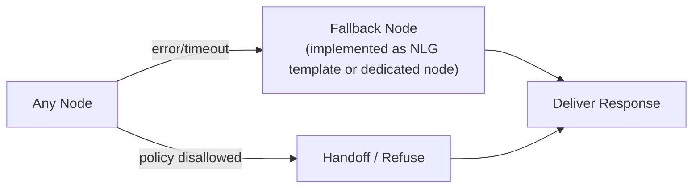

# 04_NODE_CONTRACTS - Dialogue System Design Pack
本章は **ノード仕様（契約）** を定義します。  
各ノードが **何を目的に**、State の **どのキーを読み（R）**、**どのキーを書き（W）**、失敗時に **どう振る舞うか** を固定し、実装とレビューの「契約」にします。

- DMの全体フロー（分岐・合流）は 05_WORKFLOW_DM.md
- Stateのキー・型・reducerは 03_STATE_SPEC.md
- 例外体系・モード遷移は 07_ERROR_HANDLING_AND_MODES.md
- 観測（ログ/トレース）は 14_OBSERVABILITY.md

> **変更ルール**：ノードの責務変更、R/W変更、外部I/F変更は `99_DECISIONS_LOG.md` に必ず追記。

---

## 1. Conventions（記法）
### 1.1 Node Spec Template
- **Purpose**：ノードの責務（1〜2行）
- **Inputs（Reads）**：読むStateキー
- **Outputs（Writes Δ）**：書くStateキー（差分Δ）
- **Side Effects**：外部I/O（API/DB/キュー）
- **Preconditions**：前提（必要なスロット等）
- **Postconditions**：事後条件（更新されたこと、整合条件）
- **Failure Handling**：例外・リトライ・fallback/handoff
- **Observability**：ログ/メトリクスに出すべき項目
- **Tests**：単体/統合の観点（15への参照）

### 1.2 Mermaid（bierner.markdown-mermaid）
- ノードラベルは `["..."]` を使う
- 改行は `<br/>`
- 予約語っぽいIDは避ける（`end`など）

---

## 2. Node Topology（ノード群の俯瞰）
> この章は契約の俯瞰であり、詳細な分岐は 05 を正とする。

```mermaid
flowchart TD
  start([START]) --> ir["IR<br/>(Intent Recognition)"]
  ir --> gst["GST<br/>(Goal State Tracker)"]
  gst --> route{"route<br/>by intent/mode"}
  route --> sst["SST<br/>(Slot State Tracker)"]
  sst --> sfp["SFP<br/>(Slot-filling Policy)"]
  sfp --> se["SE<br/>(Slot-filling Executor)"]
  route --> gp["GP<br/>(Goal Policy)"]
  gp --> ge["GE<br/>(Goal Executor)"]
  ge --> tool["TOOL<br/>(Integration)"]
  tool --> nlg["NLG<br/>(Response Nodes)"]
  nlg --> done([DONE])

  route --> np["NP<br/>(Non-task Policy)"]
  np --> nlg
````

---

## 3. R/W Matrix（契約の俯瞰）

> 詳細は各ノード仕様。03の表と整合すること。

| State Key       | IR | GST | SST | SFP | GP | SE | GE | TOOL | NLG | NP |
| --------------- | -: | --: | --: | --: | -: | -: | -: | ---: | --: | -: |
| `messages`      |  W |   R |   R |   R |  R |  R |  R |    W |   W |  W |
| `intent`        |  W |   R |   R |   R |  R |  - |  - |    - |   R |  R |
| `dialogue_mode` |  R |   W |   R |   W |  W |  W |  W |    R |   R |  R |
| `policy`        |  W |   R |   R |   R |  R |  R |  R |    R |   R |  W |
| `goal`          |  R |   W |   R |   R |  R |  R |  W |    R |   R |  R |
| `slots`         |  R |   R |   W |   W |  R |  W |  R |  R/W |   R |  R |
| `missing_slots` |  R |   R |   W |   W |  R |  W |  R |    - |   R |  R |
| `plan`          |  R |   R |   R |   R |  W |  R |  W |    R |   R |  R |
| `tool`          |  - |   - |   - |   - |  R |  R |  R |    W |   R |  - |
| `response`      |  - |   - |   - |   - |  R |  R |  R |    R |   W |  W |
| `trace`         |  W |   W |   W |   W |  W |  W |  W |    W |   W |  W |
| `last_error`    |  W |   W |   W |   W |  W |  W |  W |    W |   W |  W |

---

## 4. Node Specs（個別仕様）

### 4.1 IR — Intent Recognition

* **Node ID**: `IR`
* **Purpose**: ユーザー発話から意図（intent_type）を推定し、後続のDM分岐に必要な最小情報を整える
* **Inputs（Reads）**: `messages[-1]`, `policy`（任意）
* **Outputs（Writes Δ）**: `intent`, `messages+`, `trace`
* **Side Effects**: LLM call（またはルール/分類器）
* **Preconditions**: `messages` に user 発話が追加済み
* **Postconditions**

  * `intent.intent_type` が enum 内に収まる
  * `trace.node="IR"` が設定される
* **Failure Handling**

  * LLM失敗 → `last_error` 更新 → `intent.intent_type="unknown"` → NPへ
* **Observability**

  * `intent.intent_type`, `intent.confidence`, `trace.latency_ms`
* **Tests**

  * TS-NLU-001: 代表意図セットで分類できる
  * TS-NLU-002: unknown時にNPへ遷移できる

#### Δ例

```mermaid
sequenceDiagram
  participant IR as IR["IR"]
  IR->>IR: "Δ intent, Δ trace"
  Note right of IR: Δ intent.intent_type="procedure"<br/>Δ intent.confidence=0.82<br/>Δ trace.node="IR"
```

---

### 4.2 GST — Goal State Tracker

* **Node ID**: `GST`
* **Purpose**: intent と文脈から、達成すべき目標（goal）と対話モード（dialogue_mode）の初期決定を行う
* **Inputs（Reads）**: `intent`, `messages`, `slots`（任意）
* **Outputs（Writes Δ）**: `goal`, `dialogue_mode`, `plan`（初期）, `trace`
* **Side Effects**: LLM call（またはルール）
* **Preconditions**: `intent` が確定している
* **Postconditions**

  * `goal.goal_type` と `goal.status` が設定される
  * `dialogue_mode` が `STEP_BY_STEP` または `SLOT_FILLING` になる
* **Failure Handling**

  * 推定不能 → `goal.status="init"` のまま `dialogue_mode="SLOT_FILLING"`（安全側）
* **Observability**

  * `goal.goal_type`, `dialogue_mode`
* **Tests**

  * TS-DM-001: intentに応じたmode初期化

---

### 4.3 SST — Slot State Tracker

* **Node ID**: `SST`
* **Purpose**: 発話からスロットを抽出し、必須スロットの不足（missing_slots）を更新する
* **Inputs（Reads）**: `messages`, `goal`, `slots`
* **Outputs（Writes Δ）**: `slots`, `missing_slots`, `trace`
* **Side Effects**: LLM call（抽出）＋ルール（必須判定）
* **Preconditions**: `goal.goal_type` が slot要件を持つ
* **Postconditions**

  * `missing_slots` が最新化される（重複なし）
* **Failure Handling**

  * 抽出失敗 → `missing_slots` を増やさず（安全側）clarifyへ
* **Observability**

  * `missing_slots` 件数、上位数件
* **Tests**

  * TS-SLOT-001: 不足判定
  * TS-SLOT-003: 追加入力でslots更新

---

### 4.4 SFP — Slot-filling Policy

* **Node ID**: `SFP`
* **Purpose**: 不足スロットを埋めるための次アクション（確認質問/実行）を決める
* **Inputs（Reads）**: `missing_slots`, `slots`, `dialogue_mode`, `policy`
* **Outputs（Writes Δ）**: `plan.next_action`, `response.followup_question`（任意）, `trace`
* **Side Effects**: LLM call（質問生成）またはテンプレ
* **Preconditions**: `dialogue_mode="SLOT_FILLING"`
* **Postconditions**

  * missing_slots がある場合 `plan.next_action="ask"`
  * ない場合 `plan.next_action="execute"`
* **Failure Handling**

  * 質問生成失敗 → テンプレ質問へ
* **Observability**

  * `plan.next_action`, 質問有無
* **Tests**

  * TS-SLOT-002: 質問妥当性（最大2項目）

---

### 4.5 SE — Slot-filling Executor

* **Node ID**: `SE`
* **Purpose**: スロット充填モードの実行部。必要に応じてツールへ接続するための入力を整える
* **Inputs（Reads）**: `slots`, `goal`, `plan`
* **Outputs（Writes Δ）**: `plan`（tool params）, `trace`
* **Side Effects**: なし（整形のみ） or 軽量ルール
* **Preconditions**: `plan.next_action="execute"`
* **Postconditions**

  * `plan.params` に外部呼び出し用の最低限がセットされる
* **Failure Handling**

  * 不整合 → `last_error` 更新 → fallback/handoff
* **Observability**

  * `plan.params` 生成有無
* **Tests**

  * TS-SE-001: params整形

---

### 4.6 GP — Goal Policy

* **Node ID**: `GP`
* **Purpose**: STEP_BY_STEPモードで次のステップ、分岐、ツール実行可否を決める
* **Inputs（Reads）**: `goal`, `slots`, `policy`, `tool`（任意）
* **Outputs（Writes Δ）**: `plan.steps`, `plan.next_action`, `trace`
* **Side Effects**: LLM call（またはルール）
* **Preconditions**: `dialogue_mode="STEP_BY_STEP"`
* **Postconditions**

  * `plan.next_action` が `tool` / `nlg` / `handoff` 等に設定される
* **Failure Handling**

  * 失敗 → fallbackへ
* **Observability**

  * `plan.next_action`, `plan.steps` 長さ
* **Tests**

  * TS-GP-001: 代表シナリオで正しい分岐

---

### 4.7 GE — Goal Executor

* **Node ID**: `GE`
* **Purpose**: planに従い、ツール呼び出し前の入力形成・ガード・実行段取りを行う
* **Inputs（Reads）**: `plan`, `policy`, `slots`
* **Outputs（Writes Δ）**: `tool.tool_input`, `trace`
* **Side Effects**: なし（実行自体はTOOL）
* **Preconditions**: `plan.next_action="tool"`
* **Postconditions**

  * tool入力が整形される（PII最小化）
* **Failure Handling**

  * 禁止/高リスク → handoff/refuse
* **Observability**

  * `tool.tool_name`, `plan.next_action`
* **Tests**

  * TS-GE-001: tool_inputの最小化

---

### 4.8 TOOL — Tools / Integrations

* **Node ID**: `TOOL`
* **Purpose**: 外部API/DB呼び出しを行い、結果を要約してStateへ格納する
* **Inputs（Reads）**: `tool.tool_name`, `tool.tool_input`, `policy`
* **Outputs（Writes Δ）**: `tool.tool_output_summary`, `tool.tool_status`, `tool.tool_ref`, `messages+`（要約）, `trace`
* **Side Effects**: 外部I/O（KB/CRM/Ticket等）
* **Preconditions**: tool_name と tool_input が設定されている
* **Postconditions**

  * tool_status が `success|error` になる
  * 出力は全文保持せず要約＋参照IDにする
* **Failure Handling**

  * timeout → retry（上限N）→ fallback
  * 4xx（認可）→ handoff（必要情報付き）
* **Observability**

  * `tool.tool_name`, `tool.tool_status`, `trace.latency_ms`
* **Tests**

  * TS-TOOL-001: KB成功
  * TS-TOOL-002: timeout→retry→fallback
  * TS-TOOL-003: 403→handoff

---

### 4.9 NP — Non-task Policy（OOS/質問系）

* **Node ID**: `NP`
* **Purpose**: intentが `oos` / `question` の場合に、タスク本流とは別のポリシーで応答方針を決める
* **Inputs（Reads）**: `intent`, `messages`, `policy`
* **Outputs（Writes Δ）**: `response.message`（簡易）, `trace`
* **Side Effects**: LLM call（任意）
* **Preconditions**: intent_type in [`oos`,`question`]
* **Postconditions**: ユーザーに有用な短い応答、または誘導を返す
* **Failure Handling**: 失敗→テンプレ応答
* **Observability**: intent_type, response_type
* **Tests**: TS-NP-001

---

### 4.10 NLG — Response Nodes（最終応答）

* **Node ID**: `NLG`
* **Purpose**: response/messageを最終整形し、根拠や注意書きを付与して出力する
* **Inputs（Reads）**: `response`, `policy`, `tool.tool_output_summary`, `goal`, `slots`
* **Outputs（Writes Δ）**: `response.message`（最終）, `messages+`, `trace`
* **Side Effects**: LLM call（任意） or テンプレ整形
* **Preconditions**: response.message または tool結果が存在
* **Postconditions**

  * 禁止領域に触れない
  * 根拠がある場合は citations を付ける
* **Failure Handling**

  * 生成失敗→短い安全応答
* **Observability**

  * response_type, citations数
* **Tests**

  * TS-NLG-001: 根拠付与
  * TS-NLG-002: 禁止領域回避

---

## 5. Failure → Fallback/Handoff（接続点）

> 詳細は 07。ここでは「どこから落ちるか」を固定する。



---

## 6. Appendix: Spec Checklist（レビュー観点）

* Purposeが1〜2行で明確か
* Reads/Writesが03と矛盾していないか
* 失敗時の挙動（retry上限、fallback/handoff）が07と一致しているか
* tool_outputが“全文保持”になっていないか
* 観測項目が14の最小セットを満たすか
* テスト観点（単体/統合）が15にトレース可能か
