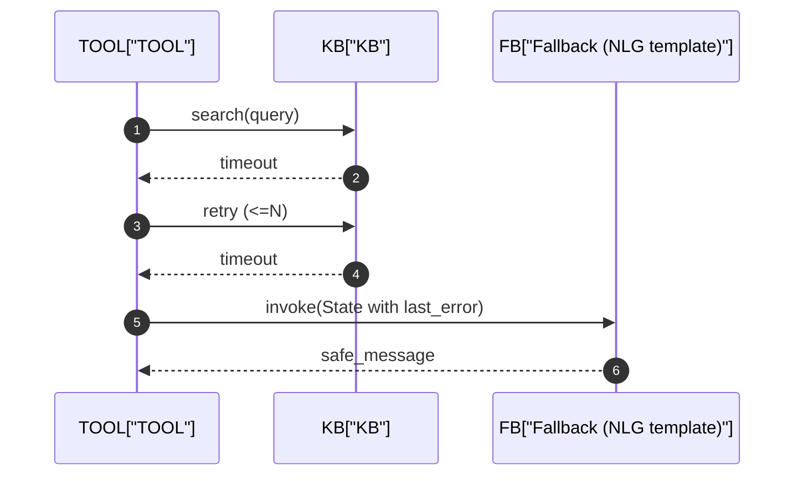
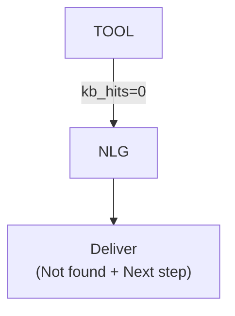
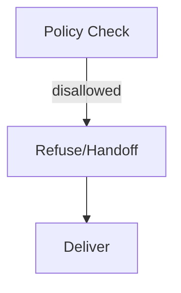

# 05_RUNTIME_UC01 - Runtime View（優先ユースケース）
本章は、優先ユースケース **UC-01** の実行時挙動（Runtime View）を定義します。  
**ノード実行順・分岐条件・State差分（Δ）・外部I/O・失敗時の縮退** を固定し、実装（Graph/Nodes）とテスト（15）に直結させます。

> 参照  
> - Stateキー定義：03_STATE_SPEC.md  
> - ノード契約：04_NODE_CONTRACTS.md  
> - DM全体フロー：05_WORKFLOW_DM.md（別章）  
> - エラー/モード：07_ERROR_HANDLING_AND_MODES.md  
> - 観測：14_OBSERVABILITY.md  

---

## 1. UC-01 概要
### 1.1 Name
- UC-01: FAQ回答（KB検索 → 根拠付き回答）

### 1.2 Goal（ユーザーの達成したいこと）
- 質問に対して、根拠（KB記事）を提示しながら回答を得る

### 1.3 Primary Actor
- End User（ユーザー）

### 1.4 Success（成功）
- `response.message` が生成され、`citations`（KB参照）が含まれる（可能な範囲で）
- 禁止領域に触れず、PIIが漏れない

### 1.5 Preconditions（前提）
- KB検索APIが利用可能（ただし失敗する可能性はある）
- セッションは `session_id` で識別され、Stateがロード可能

### 1.6 Out of Scope（このUCで扱わない）
- 公式判断が必要なケース（返金可否など）はUC-03へ
- 手続き系のスロット充填が主となるケースはUC-02へ

---

## 2. Happy Path（正常系フロー）
### 2.1 Sequence（ノード/外部I/O）
```mermaid
sequenceDiagram
  autonumber
  actor U as User
  participant API as API["API/Entrypoint"]
  participant IR as IR["IR"]
  participant GST as GST["GST"]
  participant NP as NP["NP"]
  participant GE as GE["GE"]
  participant TOOL as TOOL["TOOL"]
  participant NLG as NLG["NLG"]
  participant KB as KB["KB/Search"]

  U->>API: 質問入力
  API->>IR: invoke(State)
  IR-->>API: Δ intent, Δ trace, Δ messages(+)

  API->>GST: invoke(State)
  GST-->>API: Δ goal, Δ dialogue_mode, Δ plan, Δ trace

  alt intent_type in ["oos","question"]
    API->>NP: invoke(State)
    NP-->>API: Δ response, Δ trace
  else intent_type in ["faq","procedure"] (FAQ想定)
    API->>GE: invoke(State)
    GE-->>API: Δ tool.tool_name, Δ tool.tool_input, Δ trace

    API->>TOOL: invoke(State)
    TOOL->>KB: search(query)
    KB-->>TOOL: results
    TOOL-->>API: Δ tool(tool_output_summary/ref/status), Δ messages(+), Δ trace

    API->>NLG: invoke(State)
    NLG-->>API: Δ response.message, Δ response.citations, Δ messages(+), Δ trace
  end

  API-->>U: 応答
````

### 2.2 State Δ（差分更新）一覧

> 「どのノードが、何を更新するか」を固定する表。
> valuesは例。実データはテストケースで固定（15）。

| Step | Node | Reads（要点）                  | Writes（Δ）                                                                             | Example（抜粋）                 |
| ---: | ---- | -------------------------- | ------------------------------------------------------------------------------------- | --------------------------- |
|    0 | API  | -                          | `session_id`, `turn_id`, `messages+`                                                  | user message appended       |
|    1 | IR   | `messages[-1]`             | `intent`, `trace`, `messages+`                                                        | intent_type="faq", conf=0.8 |
|    2 | GST  | `intent`, `messages`       | `goal`, `dialogue_mode`, `plan`, `trace`                                              | mode="STEP_BY_STEP"         |
|    3 | GE   | `plan`, `goal`, `policy`   | `tool.tool_name`, `tool.tool_input`, `trace`                                          | tool="kb_search"            |
|    4 | TOOL | `tool.*`                   | `tool.tool_output_summary`, `tool.tool_ref`, `tool.tool_status`, `messages+`, `trace` | ref="kb:123"                |
|    5 | NLG  | `tool.*`, `policy`, `goal` | `response.message`, `response.citations`, `messages+`, `trace`                        | citations=["kb:123"]        |

---

## 3. Branches（分岐）

### 3.1 OOS / Question（非タスク応答）

* 条件：`intent.intent_type in ["oos","question"]`
* 遷移：`NP → NLG（任意） → Deliver`
* 期待：短い回答・誘導・注意喚起（禁止領域回避）

```mermaid
flowchart TD
  ir["IR"] --> gst["GST"]
  gst --> decide{"intent_type?"}
  decide -->|"oos/question"| np["NP"]
  np --> deliver["Deliver"]
  decide -->|"faq"| ge["GE"]
```

---

## 4. Error & Fallback（異常系・縮退）

### 4.1 KB timeout（TOOL失敗 → retry → fallback）

* 条件：KB検索が `timeout`
* ポリシー：最大 `N` 回リトライ（値は07で確定）
* それでも失敗：fallback応答（安全に）＋人手/再試行案内



#### State Δ（timeout時）

| Step | Node     | Writes（Δ）                                         | Notes                |
| ---: | -------- | ------------------------------------------------- | -------------------- |
|   4a | TOOL     | `last_error`, `tool.tool_status="error"`, `trace` | error_type="timeout" |
|   4b | Fallback | `response.message`, `trace`                       | “できない理由＋次の手段”        |

---

### 4.2 Empty hit（0件）→ “見つからない”を明示

* 条件：KB検索結果が0件
* 期待：断言しない、代替（質問/手続き/オペレータ）を提示



---

### 4.3 Policy disallowed（禁止領域）→ refuse/handoff

* 条件：`policy.disallowed=true`
* 期待：安全に拒否（または人へ引き継ぎ）



---

## 5. Observability（観測要件：UC-01の最小）

> 詳細は14。ここではUC-01として必須の“イベント”を固定。

* 各ノードで必ず記録

  * `session_id`, `turn_id`
  * `trace.node`, `trace.action`, `trace.latency_ms`, `trace.outcome`
* UC-01として重要

  * `intent.intent_type`, `intent.confidence`
  * `tool.tool_name`, `tool.tool_status`, `tool.tool_ref`
  * `response.citations`（件数）
  * エラー時：`last_error.error_type`

---

## 6. Acceptance Criteria（UC-01の受け入れ条件）

* Given FAQ質問（代表例）
  When UC-01を実行
  Then `response.message` が返る
* Given KBに該当記事がある
  When UC-01を実行
  Then `response.citations` に参照IDが含まれる
* Given KBがtimeoutする
  When UC-01を実行
  Then retry後に fallback 応答が返り、致命停止しない
* Given 禁止領域入力
  When UC-01を実行
  Then refuse/handoff に遷移し、安全に応答する

---

## 7. Test Mapping（15_TEST_PLANへの接続）

* TS-UC01-001: FAQ（ヒットあり）→ citationsあり
* TS-UC01-002: FAQ（ヒットなし）→ not found + next step
* TS-UC01-003: KB timeout → retry → fallback
* TS-UC01-004: policy disallowed → refuse/handoff

