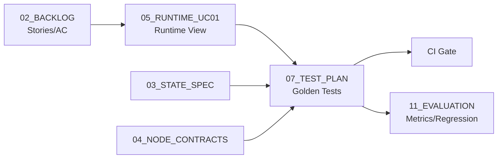

````md
# 07_TEST_PLAN - Dialogue System Design Pack
本章は **テスト計画（Test Plan）** です。  
特に、モデル/プロンプト/ワークフロー変更で壊れやすい対話システムに対して、**Golden（固定）テスト**を中心に回帰を担保します。  
本章は **常に更新（Living Spec）** されます。変更時は `99_DECISIONS_LOG.md` に必ず追記してください。

> 参照  
> - Runtime: 05_RUNTIME_UC01.md（優先ユースケース）  
> - State: 03_STATE_SPEC.md  
> - Node Contract: 04_NODE_CONTRACTS.md  
> - Observability: 14_OBSERVABILITY.md  
> - Backlog: 02_BACKLOG.md（Story ↔ Test）  

---

## 1. Purpose（目的）
- **回帰防止**：モデル/プロンプト/ノード変更で既存ユースケースが壊れないことを保証する
- **検証可能性**：Given/When/Then と期待結果（State差分・出力・ログ）を固定する
- **運用品質**：エラー/縮退（retry/fallback/handoff）が設計通り動くことを保証する
- **観測担保**：最低限のログ・トレース項目が出続けることを保証する

---

## 2. Test Levels（テストレベル）
### 2.1 Unit（ノード単体）
- 対象：IR/GST/SST/SFP/GP/GE/TOOL/NP/NLG など
- 主眼：入力State → 出力Δ（差分）の妥当性、境界条件、失敗時の挙動
- 外部I/O：必ずモック（Tool adapter stub）

### 2.2 Integration（フロー統合）
- 対象：UC単位（例：UC-01）
- 主眼：ノード順序・分岐・State遷移・ツール連携の整合

### 2.3 E2E（API含む）
- 対象：チャネル/認証/永続化を含む最小経路
- 主眼：実運用に近い形の疎通、レイテンシ・ログ出力

---

## 3. Golden Test Policy（固定テストの方針）
### 3.1 Goldenとは
- **固定入力**（対話ログ、外部ツール応答スタブ、設定）に対して
- **固定期待結果**（State抜粋・出力・ログ・遷移）を検証する回帰テスト

### 3.2 期待結果の粒度（壊れにくく・価値を落とさない）
- **厳密一致（Strict）**：Stateキーの存在、enum、分岐、エラー種別、ログ項目、ツール呼び出し回数
- **準一致（Loose）**：自然文出力は「完全一致」を避け、以下で評価
  - 必須フレーズ（must contain）
  - 禁止フレーズ（must not contain）
  - 参照（citations/tool_ref）の存在
  - 形式（箇条書き、手順番号など）
- **LLM評価**（任意）：後段で自動採点（11_EVALUATION）へ

### 3.3 実行モード
- `MODE=stubbed`：LLM/Toolを固定スタブにして determinism を最大化（CIの基本）
- `MODE=live`：実LLM・実KB（夜間/手動）でスモーク（品質監視）

---

## 4. Test Artifacts（テスト資産）
推奨配置：
```text
tests/
  golden/
    uc01/
      input.json
      tool_stub_kb.json
      expected_state_subset.json
      expected_output_rules.yaml
      expected_trace.yaml
    uc02/...
  unit/
  integration/
  e2e/
````

### 4.1 入力（Input）

* `session_id` は固定（例：`"sess_golden_uc01_001"`）
* `messages` は固定（user/assistant/toolを明示）
* `config`（リトライ上限、topK、モード）は固定

### 4.2 期待結果（Expected）

* `expected_state_subset.json`：State全体ではなく **重要キーの抜粋**（03参照）
* `expected_output_rules.yaml`：必須/禁止/構造のルール
* `expected_trace.yaml`：ノード順序、tool呼び出し、outcome、必須ログ項目

---

## 5. Golden Test Suite（一覧）

> 優先ユースケース（UC-01）から開始し、スプリントで増やす。

### 5.1 UC-01（FAQ回答）— Golden

| Test ID     | Scenario                           | Type        | Priority | Notes |
| ----------- | ---------------------------------- | ----------- | -------- | ----- |
| TS-UC01-001 | KBヒットあり → citations付き回答            | Integration | P0       | 最重要   |
| TS-UC01-002 | KBヒット0件 → not found + 次の手段         | Integration | P0       | 断言防止  |
| TS-UC01-003 | KB timeout → retry → fallback      | Integration | P0       | 縮退    |
| TS-UC01-004 | policy disallowed → refuse/handoff | Integration | P0       | 安全    |
| TS-UC01-005 | OOS/question → NP経由で短い応答           | Integration | P1       | NP品質  |

---

## 6. Golden Test Specs（代表：UC-01）

> 期待結果は「State差分」「出力ルール」「遷移/トレース」で検証する。

### TS-UC01-001：KBヒットあり → citations付き回答

**Given**

* `messages[-1].role="user"` の質問（例：「営業時間は？」）
* Tool stub（KB検索）が topK=3 のヒットを返す

**When**

* グラフを1ターン実行する（`MODE=stubbed`）

**Then（State）**

* `intent.intent_type` が `"faq"`（または `"question"` + FAQ扱いの設計ならそれに準拠）
* `tool.tool_status="success"`
* `tool.tool_ref` が `"kb:<id>"` 形式
* `response.citations` が1件以上
* `policy.disallowed=false`

**Then（Output rules）**

* must contain：根拠を示す（例：記事タイトル or 参照ID）
* must not contain：個人情報、過度な断言（「絶対」「100%」等 ※必要なら拡張）

**Then（Trace）**

* 必須ノード順（例）：IR → GST → GE → TOOL → NLG（NPが入る設計ならそれに準拠）
* `trace.latency_ms` が全ノードで記録される

---

### TS-UC01-003：KB timeout → retry → fallback

**Given**

* KB検索が timeout を返す tool stub
* retry上限 `N=2`（設定固定）

**When**

* グラフを1ターン実行（`MODE=stubbed`）

**Then（State）**

* `tool.tool_status="error"`
* `last_error.error_type="timeout"`
* `response.message` が非空（fallback）
* `response.message` に「次の手段」（再試行/人手/別導線）が含まれる

**Then（Trace）**

* TOOL呼び出し回数が `N+1` 以下（初回+retry）
* outcome が `fallback` で終わる

---

## 7. Unit Tests（ノード単体）— 最小セット

> ノード契約（04）に対する「入出力Δの検証」。

| Test ID          | Node | Focus                                | Priority |
| ---------------- | ---- | ------------------------------------ | -------- |
| TS-UNIT-IR-001   | IR   | 代表意図セット分類                            | P0       |
| TS-UNIT-GST-001  | GST  | mode初期化（STEP_BY_STEP / SLOT_FILLING） | P0       |
| TS-UNIT-SST-001  | SST  | slots抽出・missing更新                    | P0       |
| TS-UNIT-SFP-001  | SFP  | missing→ask / none→execute           | P0       |
| TS-UNIT-TOOL-001 | TOOL | success時の要約＋ref格納                    | P0       |
| TS-UNIT-TOOL-002 | TOOL | timeout→retry→error                  | P0       |
| TS-UNIT-NLG-001  | NLG  | citations付与・禁止領域回避                   | P0       |

---

## 8. Integration / E2E（拡張計画）

### 8.1 Integration（UC-02/03）

* UC-02（手続き案内）：

  * 不足→確認→充填→手順提示
* UC-03（handoff/ticket）：

  * 解決不能→handoff payload→（任意）チケット起票

### 8.2 E2E（最小）

* API → Graph → Response の疎通
* Checkpointロード/保存（セッション継続）
* 監査ログ（最小項目）が出る

---

## 9. Observability Assertions（観測のテスト）

> 14_OBSERVABILITY.md の最小要件をテストで守る。

**必須ログ項目（例）**

* `session_id`, `turn_id`
* `trace.node`, `trace.action`, `trace.latency_ms`, `trace.outcome`
* `intent.intent_type`, `dialogue_mode`
* `plan.next_action`
* `tool.tool_name`, `tool.tool_status`
* `policy.disallowed`, `policy.pii_detected`, `policy.risk_level`

**テスト**

* TS-OBS-001：1ターン実行で必須項目が欠けない
* TS-OBS-002：失敗系でも `last_error` と outcome が出る

---

## 10. CI Gate（合格基準）

### 10.1 PR必須（P0）

* Golden：TS-UC01-001/002/003/004 が全てPASS
* Unit：P0ユニットがPASS
* Observability：TS-OBS-001 がPASS

### 10.2 変更種別ごとの追加ゲート

* プロンプト変更：Golden + NLG関連Unit + （任意）自動採点（11）
* ツールI/F変更：TOOL Unit + timeout/fallback + contract更新（04/09）
* State変更：03更新 + 関連Golden更新 + 99記録

---

## 11. Mermaid（テストと設計の対応関係）



---

## 12. Change Rules（更新ルール）

* 新しいユースケースを実装したら、対応する **Golden** を最低1本追加する
* Stateキー変更時は、必ず以下を更新

  * 03_STATE_SPEC.md
  * 04_NODE_CONTRACTS.md
  * 07_TEST_PLAN.md（該当expected）
  * 99_DECISIONS_LOG.md（変更理由）
* 外部I/F変更時は、tool stub と expected_trace を更新する

---

## 13. Open Items（未決）

* LLM出力の自動採点方式（ルールベース vs LLM judge）
* NP（OOS/question）の品質評価の指標化
* コスト指標（token/API回数）のCIゲート化
