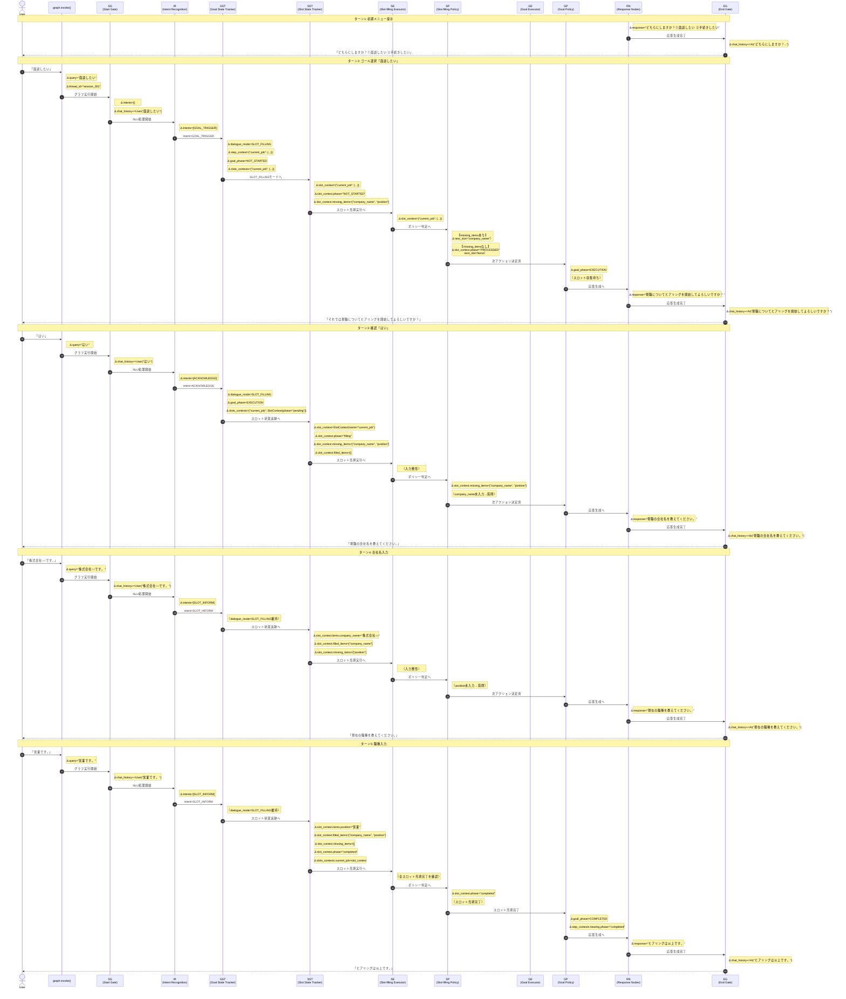
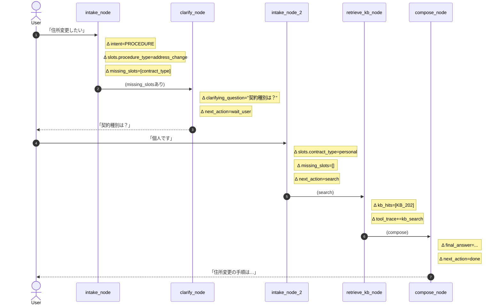

対話シナリオに沿って、各ノードで各State変数をどう変更するかを示す。

## サンプル対話シナリオ: 面談

### シナリオ
- AI：「どちらにしますか？①面談したい ②手続きしたい」
- User：「面談したい」
- AI：「それでは現職についてヒアリングを開始してよろしいですか？」
- User：「はい」
- AI：「現職の会社名を教えてください。」
- User：「株式会社○○です。」
- AI：「現在の職種を教えてください。」
- User：「営業です。」
- AI：「ヒアリングは以上です。」

### シーケンス図.

---
## 書き方サンプル.※修正しないこと。

